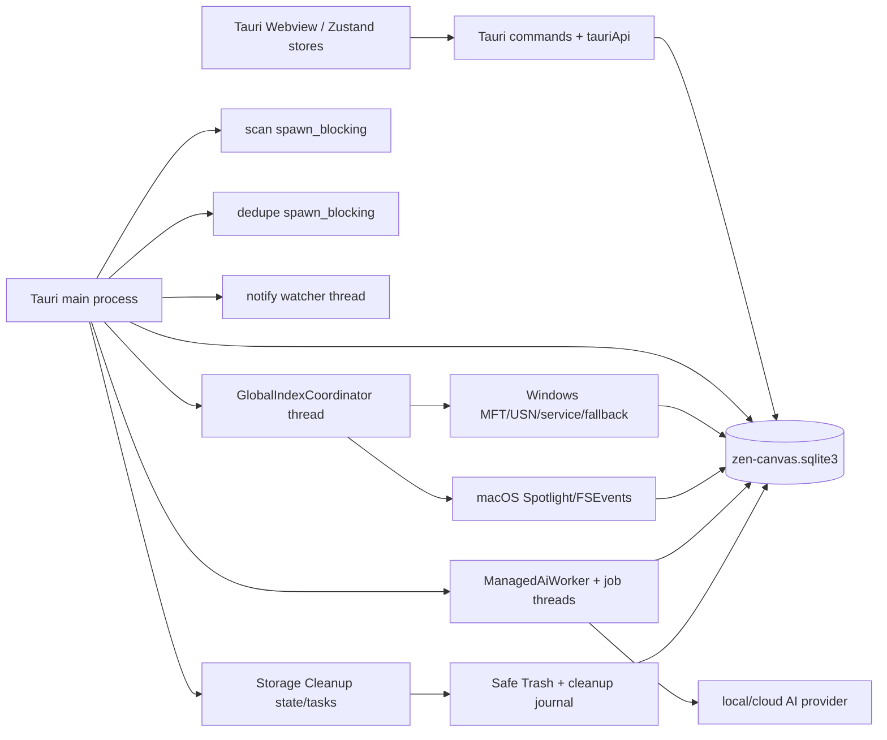
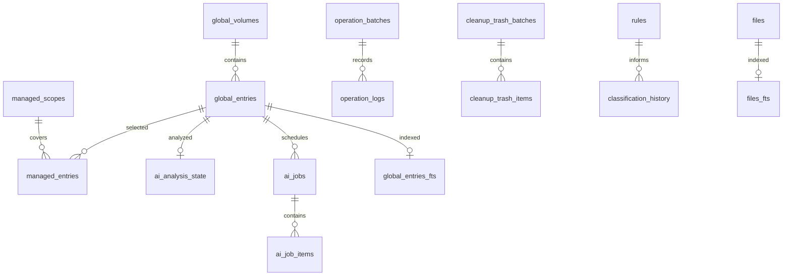

# Task 00：PR #15 合并后基线架构审计

## 0. 审计结论摘要

本审计以 PR #15 的合并提交 `a2c0516dc7a8628cb7210003da3d66f5d84f3a2f` 为唯一代码基线，提交范围只包含 `docs/remediation/` 文档。Task 00 没有修改生产代码、数据库 schema、依赖、测试或业务行为。

最重要的架构判断如下：

1. PR #15 已经建立了单库全局索引、平台 provider、Managed Scope、持久化 Managed AI 队列、文件身份校验、Safe Trash 和操作恢复账本。后续整改不能再建设第二套全局索引、第二套 Managed AI 队列或绕过既有预览/账本/恢复链路。
2. Managed AI 的 `ai_jobs` 是一个带 Managed Scope、provider policy、输入指纹、用户纠正保护和前后置复核的领域队列。它不是可直接抽取为通用 Job Runtime 的证据；直接泛化会破坏当前安全边界。
3. File Library 扫描、watcher、dedupe、Storage Cleanup 仍有不同程度的进程内状态；全局索引 provider 也只有部分 durable checkpoint，fallback watcher 的变更集合在进程重启时丢失。任何“统一运行时”或“持久化 reconciliation”改造都必须先单独定义 owner、恢复语义、取消语义和 migration/rollback。
4. `files` 的主键仍由扫描路径写入，Global Index 使用平台文件身份并在必要时退回 `path:` 身份；两者不能在没有迁移和冲突策略的情况下直接合并。
5. Library Query 已有过滤、FTS、分页和虚拟列表，但核心 SQL 仍使用 `LIMIT/OFFSET`，跨页选择/批量决策/实时一致性没有形成统一的 query/selection contract。
6. 当前 AI 仅向 provider 发送文件元数据和受控路径提示；`ai_analysis_state.content_summary` 明确写入 `metadata_only`。AI trace 中的 `extracted_content` 是 provider 响应解析的内存诊断字段，不是文件内容抽取物或可复用内容 artifact。
7. Organization Plan、Analysis Run/Findings、Content Artifact、NL Rule Proposal、Search Provider Manifest 等候选能力尚未形成可执行的持久化契约。Task 01 及后续 Task 必须保持“待人工验收/不可执行”，直到下文列出的人工决策完成。

文档中的判断按以下方式区分：

- **源码事实**：可由当前提交中的路径和 symbol 直接核验。
- **审计判断**：根据多个源码事实推导出的架构边界、缺口或冲突。
- **后续建议**：仅用于人工验收后的规划，不构成本次实现授权。

## 1. 基线、范围与验证

### 1.1 Git 基线

| 项目 | 结果 |
| --- | --- |
| 仓库 | `ArdenZC/Zen-Canvas` |
| 基线分支 | `master` |
| PR #15 合并提交 | `a2c0516dc7a8628cb7210003da3d66f5d84f3a2f` |
| 基线提交标题 | `Merge pull request #15 from ArdenZC/agent/system-wide-search-hardening` |
| 审计分支 | `remediation/00-post-merge-audit` |
| 版本 | `0.1.40` |
| 工作树策略 | 保留原有未纳入本任务的工作树内容；提交时只显式 stage `docs/remediation/` |
| 生产代码 diff | 无 |
| schema/dependency diff | 无 |

开始时先在 `master` 上执行 fast-forward 拉取，并验证上述 SHA 是 `HEAD` 的 ancestor；没有执行 reset、rebase 或覆盖用户内容。

### 1.2 基线验证结果

以下命令在 PR #15 基线、Task 00 分支且尚未修改生产代码时执行：

| 命令 | 结果与观测 |
| --- | --- |
| `npm.cmd run typecheck` | PASS |
| `npm.cmd test` | PASS；68 个 test files，474 个 tests |
| `npm.cmd run test:remediation` | PASS；1 个文件，13 个 tests |
| `npm.cmd run test:performance` | PASS；架构 guard、bounded checks 2 files/9 tests；100,000 rows SQLite/FTS benchmark；search p50 2.268 ms、p95 3.779 ms、max 3.779 ms；threshold 1000 ms |
| `npm.cmd run build` | PASS；Vite 2070 modules；Rust release；生成 `src-tauri/target/release/bundle/nsis/Zen Canvas_0.1.40_x64-setup.exe`；存在大 chunk warning |
| `npm.cmd run verify:rust` | 最终 PASS；fmt、desktop-runtime tests、clippy `-D warnings` 全部通过；串行重跑 `RUST_TEST_THREADS=1` 为 lib 400 passed/0 failed/1 ignored，集成测试全部通过。此前两次默认并行 full-suite 各出现一次不同的文件操作/FTS 瞬时失败，两个失败测试定向重跑均通过；未修改生产代码 |
| `npm.cmd run security:audit` | PASS；0 vulnerabilities |
| `npm.cmd run security:audit:rust` | PASS（exit 0）；扫描 1169 advisories、520 dependencies，输出 15 个 allowed warnings，包括 GTK/`proc-macro-error`/`unic-*` unmaintained 和 `glib` unsound advisory；Task 00 不修复这些业务/依赖风险 |

Performance benchmark 的 pre-optimize probe 约 50 秒，而 optimize 后查询为毫秒级；这属于现有 benchmark 的风险信号，已登记在风险表，不在本任务修复。

## 2. 仓库开发契约和不可越过的安全边界

### 2.1 源码事实

- `package.json` 将 `typecheck`、`test`、`test:remediation`、`test:performance`、`build`、`verify:rust`、npm/cargo audit 和 `verify` 固定为本地/CI 验证面。
- `.github/workflows/ci.yml` 在 Windows/macOS matrix 上执行前端、Rust、remediation、性能、native smoke、路径/temp 回归和构建；`.github/workflows/release-build.yml` 还固定 tag、SBOM、checksum、安装包和发布流程。
- `src-tauri/src/main.rs::setup` 打开单一应用数据库，启动 `GlobalIndexCoordinator`、`ManagedAiWorker`、`ScanJobManager`、`DedupeJobManager`、`FileWatcherManager`，并在启动时调用 `file_ops::reconcile_pending_operation_journal`、`storage_analyzer::reconcile_pending_cleanup_journal`。
- `src-tauri/src/db/schema.rs::CURRENT_SCHEMA_VERSION` 为 `26`；`migrate` 在同一个 `zen-canvas.sqlite3` 上执行迁移和 global-index hardening。
- `src-tauri/src/ai/prompts.rs` 明确要求不得绕过 Safe Trash、preview、confirmation 或 restore；`src-tauri/src/global_index/legacy_queue.rs` 明确要求 File Library 的 AI 只能进入 Managed AI durable queue。

### 2.2 审计判断

后续工作必须把“是否可执行”作为独立 gate，而不是把候选模块视为已批准的施工清单。尤其不能因为已有 `ai_jobs`、`operation_logs` 或 `global_entries` 就隐含批准一个跨域抽象。

### 2.3 后续建议

在人工验收前，任何后续 Task 只能停留在契约、schema 草案、迁移计划、回滚计划和测试设计；不得预先添加空的 runtime、queue、artifact 或 migration 表。

## 3. 当前运行时和进程边界

### 3.1 运行时拓扑

### 3.2 进程/线程/任务表

| owner | 生命周期 | 状态 | 持久化事实 | 取消/恢复 |
| --- | --- | --- | --- | --- |
| Tauri main | 应用生命周期 | DB handle、command state、shutdown | 数据落主库 | Exit 时停止 coordinator/worker；启动 reconcile 文件操作和 cleanup journal |
| Webview renderer | 窗口生命周期 | `useScanManagerStore`、`useBackgroundIndexerStore`、`useFileLibraryStore`、watcher queue | store/queue 主要为内存；scope 可写 localStorage | 请求失效用 request id；窗口重启不恢复这些队列 |
| Global Index Coordinator | 独立 Rust thread | provider loop、cancel flag、临时 reconcile state | `global_volumes`/`global_entries`/FTS；volume journal cursor 可持久化 | pause/resume/rebuild/shutdown；provider-specific，fallback pending 不具备 durable replay |
| Windows index service | 可选独立进程，由 service host/SCM 管理 | named pipe、operation lock、busy/cancel | 桌面端和 service 通过主库/pipe 协作 | service 重启由 SCM 负责；客户端有 direct least-privilege fallback |
| ManagedAiWorker | 独立 Rust thread + 每 job thread | `ai_jobs` claim、provider call、validation | `ai_jobs`、`ai_job_items`、`ai_analysis_state` | 启动 reset running；最多 3 次 attempt；policy/user correction/fingerprint 前后复核 |
| Managed scan | command `spawn_blocking` | `ScanJobManager` HashMap + AtomicBool | `files` rows、stale/last_seen；无 scan run/generation 表 | cancel 为进程内 flag；完成后 stale cleanup；重启不恢复中断 scan |
| File watcher | notify thread + renderer queue | bounded channel、coalesce、overflow flag | watcher 本身不写 durable change journal；global provider 有独立 provider 逻辑 | overflow 只发 rescan-required；renderer 批量 upsert；重启依赖重扫 |
| Dedupe | `spawn_blocking` job | `DedupeJobManager` HashMap + AtomicBool | `files.content_hash`；没有 duplicate group/run/finding 表 | cancel/进度事件；按 size + full BLAKE3；重启不恢复 job |
| Storage Cleanup | command tasks + `StorageCleanupState` | in-memory analysis/candidates/pages | Safe Trash 的 cleanup journal durable；analysis/findings/job 不 durable | cancel flag；cleanup journal 启动 reconcile；候选分析重启丢失 |

**源码证据**：`src-tauri/src/main.rs::setup`、`RunEvent::ExitRequested`；`src-tauri/src/global_index/coordinator.rs::GlobalIndexCoordinator/run_index`；`src-tauri/src/global_index/managed_worker_hardened.rs::ManagedAiWorker/run_worker`；`src-tauri/src/scanner.rs::ScanJobManager/scan_directory_blocking`；`src-tauri/src/watcher.rs::FileWatcherManager`；`src-tauri/src/dedupe.rs::DedupeJobManager`；`src-tauri/src/storage_analyzer.rs::StorageCleanupState`；`src/store/useBackgroundIndexerStore.ts`、`src/hooks/fsWatcherQueue.ts`。

## 4. 数据库关系和持久化语义

### 4.1 当前关系

### 4.2 源码事实

- `src-tauri/src/db/schema.rs::ensure_global_index_schema` 在主库创建 `global_volumes`、`global_entries`、`managed_scopes`、`managed_entries`、`ai_analysis_state`、`ai_jobs`、`ai_job_items` 及 global FTS；不存在独立的 global SQLite 数据库或持久化 staging DB。
- `files`/`files_fts` 是既有 File Library 链路；`operation_batches`/`operation_logs` 是文件移动/恢复账本；`cleanup_trash_batches`/`cleanup_trash_items` 是 Safe Trash 账本；`rules`、`app_settings`、`classification_history`、`classification_feedback` 属于现有分类/设置域。
- Windows MFT 的临时 SQLite 只作为一次 enumerate 的 staging，`src-tauri/src/global_index/windows/mft.rs` 在过程结束删除；它不是业务持久化队列。
- `global_entries` 使用 `volume_id` 外键和 `platform_file_id`/parent identity；`files` 由 `src-tauri/src/scanner.rs::scanned_entry_to_insert_request` 写入 `id = entry.path.clone()`。
- `src-tauri/src/global_index/legacy_queue.rs::enqueue_legacy_targets_for_managed_ai` 以规范化路径在启用 volume 和 Managed Scope 中解析 File Library row；找不到 global/managed coverage 时跳过，不会为 unmanaged 内容直接排队。

### 4.3 审计判断

当前数据库是“同一 SQLite、多个领域表”，不是一个已经统一的任务模型。`files` 与 `global_entries` 既不能只凭路径认为是同一实体，也不能把 operation/cleanup journal 当成通用 execution log。跨域抽象需要显式的 owner、外键/引用、状态机和迁移回滚策略。

## 5. 扫描、索引和 watcher 的调用链

### 5.1 File Library 扫描

**源码事实**：`src-tauri/src/scanner.rs::scan_directory_blocking` 验证 root，使用 `jwalk` 扫描，跳过受保护目录/符号链接策略，批量写 `files`，完成时调用 `mark_missing_files_stale_after_scan`，然后优化 FTS 并可调度 dedupe。`ScanJobManager` 只在内存中维护 job id 和取消 flag。前端 `src/store/useScanManagerStore.ts`、`useBackgroundIndexerStore.ts` 负责 root 队列顺序、进度和 refresh；后台历史只保留有限内存记录。

**审计判断**：扫描“完成/部分完成/取消/错误/需要重扫”没有 durable generation 或 run record。对于重启、崩溃、root 设置变更或多窗口并发，当前系统只能依赖下一次扫描和 `files.is_stale/last_seen_at` 重新收敛。

### 5.2 Global Index

**源码事实**：

- `src-tauri/src/global_index/coordinator.rs` 用单一 coordinator thread 循环发现 volume、选择 initial/rebuild/incremental provider 调用，并把状态/checkpoint 写入 `global_volumes`。
- Windows `src-tauri/src/global_index/windows/mft.rs` 使用 native file reference/parent reference；`usn.rs::sync_volume` 校验 journal id/cursor，遇到 history gap、rename directory 或 journal 错误时进入 rebuild/full reconcile。
- Windows `src-tauri/src/global_index/windows/service.rs`/`service_host.rs` 提供版本化 named-pipe metadata protocol；desktop 在 service unavailable 时使用 direct provider/fallback。
- Windows `fallback.rs::ReconcileWatcher` 的 bounded notify channel 只作为变化信号；overflow 后下一次 recursive scan 才是权威来源，不存在 durable change queue。
- macOS `global_index/macos/mod.rs` 维护 `PendingUpdates`、Spotlight query 和 FSEvents pending state；event id 在 checkpoint 时写入 volume，但 pending 集合本身为进程内状态。
- `global_index/repository.rs` 负责 upsert、stale、scope policy 和 AI job enqueue；`global_index/search.rs` 与 File Library 查询隔离，不接受 `LibraryScope`，并过滤 disabled/stale volume/entry。

**审计判断**：全局索引已经是独立且应复用的主索引；真正缺的是各 provider 的一致 reconciliation contract 和 fallback restart recovery，而不是再建立一个 global index。`global_volumes` 的 cursor 是 source-specific checkpoint，不等于通用 scan generation 或所有变更的可靠回放点。

### 5.3 File watcher 与最终一致性

**源码事实**：`src-tauri/src/watcher.rs` 通过 bounded `sync_channel(2048)`、150 ms coalesce 和 `fs-event` payload 发出 stale/upsert 路径；`src/hooks/fsWatcherQueue.ts` 和 `useFsWatcher.ts` 在 renderer 批量调用 upsert/remove。overflow 只产生 rescan required 信号。Global Index 的 Windows/macOS provider 各自拥有独立 watcher/provider pending 逻辑。

**审计判断**：当前存在三种“变化通道”：File Library watcher、Windows USN/fallback、macOS FSEvents/Spotlight。它们没有一个统一的 durable event owner。若 Task 01 直接将 renderer watcher、global provider pending、scan queue 合并，会引入重复消费、scope 越权或丢事件的风险。

## 6. 队列、任务、取消、错误和恢复

### 6.1 Managed AI：完整但领域专用

**源码事实**：`src-tauri/src/global_index/managed_worker_hardened.rs` 提供 `reset_running_managed_ai_jobs`、`claim_next_managed_ai_job`、`validate_managed_ai_job`、`complete_managed_ai_job`、`fail_managed_ai_job`；worker 启动时恢复 running，concurrency 为 1–4，失败最多 3 次，provider call 前后校验 scope/provider/volume/entry/fingerprint/user correction。`complete_managed_ai_job` 将结果写入 `ai_analysis_state.classification_json`，并设置 `content_summary = 'metadata_only'`。`legacy_queue.rs` 的取消只把 pending/running 标为 canceled，并同步 item/state。

**审计判断**：这些是高价值的安全语义，但字段和状态强绑定 `global_entry_id`、`managed_scope_id`、provider 和 AI analysis。它不能直接成为扫描、dedupe、cleanup、operation 的共享 runtime；可以在未来另行评估“生命周期 primitives”是否可抽取，但必须先维持现有表和 policy gate。

### 6.2 其他任务的真实状态

| 域 | 已有能力 | 缺口 |
| --- | --- | --- |
| Scan | in-memory job、progress、cancel、stale cleanup | 无 durable run/generation、无 crash recovery、无统一 parent/child job |
| Global Index | durable volume state/cursor、provider status、pause/rebuild | source-specific；fallback/mac pending 不 durable；无通用 run history |
| Dedupe | in-memory job、size candidate、BLAKE3、identity guard | 无 run/group/finding、无恢复、无 physical identity/reclaim plan |
| Cleanup | in-memory analysis/candidates、preview、cancel；Safe Trash durable journal | findings/analysis run 不 durable；AI cleanup 仅 advisory |
| File operations | durable operation batch/log、claim/phase、startup reconcile、restore | 只覆盖文件操作；preview 是计算结果，不是 versioned plan |

### 6.3 取消和恢复的共同风险

**审计判断**：全局“取消”不能被定义成一个 AtomicBool 的统一包装。至少需要区分：

- 用户主动取消：是否保留可重试 pending、是否写 terminal canceled；
- 崩溃恢复：running 是否安全回退 pending，是否需要 source cursor rollback；
- stale/invalidation：输入身份变化时应 stale 而不是 retry；
- policy block：scope/provider/security 变化时必须 block，不能当 provider error；
- partial commit：batch 已写入但 progress 未发出时，下一代如何判断事实。

## 7. 身份、指纹、dedupe 和跨表实体

### 7.1 源码事实

- `src-tauri/src/global_index/models.rs::GlobalEntryInput::from_path/stable_entry_id` 优先使用 volume + native platform id + parent/name；path fallback 使用 `platform_file_id = path:<normalized path>`。
- `src-tauri/src/fs_safety/identity.rs::ExpectedFileIdentity/capture_identity` 记录 size、modified ns、platform volume/file id、sample hash、full BLAKE3；目录使用 manifest hash；move/restore 前后做 identity match，并拒绝 symlink/reparse 等不安全情况。
- `src-tauri/src/path_identity.rs` 负责 Windows case/separator normalization 与 macOS/Unix case semantics；它不是跨平台数据库主键。
- `files.id` 在 scanner 中是扫描路径；`files.content_hash` 仅在 dedupe candidate 通过 size、mtime/size guard 后写入 BLAKE3；classification fingerprint 字段是 `last_classified_mtime/size/rule_version`。
- `src-tauri/src/dedupe.rs::run_duplicate_detection_job` 用 `(size, content_hash)` 聚合显示 duplicate，未建立 durable duplicate group/finding/reclaim amount；hardlink/physical file identity 不是该聚合键。

### 7.2 审计判断

当前至少有四种不同用途的“身份/指纹”：路径主键、global native identity、filesystem operation identity、AI/classification input fingerprint。它们不能在 Task 01 中改名后直接复用。未来统一 identity 需要处理：路径移动、跨 volume、大小写、provider 变化、native id 缺失、hardlink、外部修改、旧 operation log 和用户纠正。

## 8. Managed Scope、AI、规则和内容理解

### 8.1 Managed Scope 和 provider boundary

**源码事实**：`src-tauri/src/global_index/managed_scope.rs` 创建 scope 时规范化 path、可解析 global entry，并通过 `backfill_managed_scope` 建立 managed entries；初次 backfill 只 enqueue 前 100 个非目录项。scope 默认允许 local、禁止 cloud；`legacy_queue.rs` 只接受 enabled volume + enabled scope + enabled managed entry；worker 在 claim、pre-call、post-call 都复核 provider policy、scope enabled、entry stale、user_corrected。

**审计判断**：Global Index 是 metadata discovery，Managed Scope 是 AI authorization boundary。Global search 结果可以展示未 managed entry，但不能因此进入 AI 队列。任何内容 artifact、批量 AI 或自然语言规则设计都必须显式绑定 scope 和 provider consent。

### 8.2 当前 AI 输入/输出

**源码事实**：

- `src-tauri/src/ai/classification.rs::ai_input_file_from_row/build_ai_classification_prompt` 以 refId、name、extension、size、mtime 和按设置发送的 full/parent path 组装请求；没有 filesystem content extractor。
- `src-tauri/src/global_index/managed_worker_hardened.rs::build_managed_ai_request` 默认 metadata-only，可按设置发送 full/parent path，并显式填 `isDirectory: false`。
- `ai_analysis_state` 的完成路径写入 `classification_json` 和 `content_summary = 'metadata_only'`；没有 content artifact table/blob/cache。
- `src-tauri/src/ai/trace.rs` 的 `raw_provider_response`、`extracted_content`、`cleaned_json_text` 是最多 32 条的进程内 trace，存在截断和 secret/path redaction；它们是诊断记录，不是文件内容抽取物。
- `src-tauri/src/ai/cleanup.rs` 读取候选事实生成 advisory 分析；AI 输出不能升级为直接 delete，实际动作仍走 preview、identity、Safe Trash/journal。

**审计判断**：当前“内容理解”候选能力不存在。不能把 response parse 的 `extracted_content` 误认成可供搜索、复用、版本化或权限控制的文件内容。新增 Content Artifact 前必须由人工决定内容类型、大小上限、脱敏、local/cloud policy、重建/失效、存储位置、删除和恢复语义。

### 8.3 规则和自然语言

**源码事实**：`src-tauri/src/db/queries/rules_repo.rs` 校验 root/group operator、condition field/operator/value 和 action/template；`src/views/automation/AutomationRuleDialog.tsx` 提供结构化表单；`src-tauri/src/db/learning.rs` 可从用户 correction 学习有限 rule hints。现有规则是受约束的 JSON AST/结构化编辑，不存在 NL proposal/compiler/approval artifact。

**审计判断**：NL Rule Proposal 可以把现有 AST 作为目标格式，但不能直接把模型输出当成可执行 rule，更不能直接触发 file operation。后续应先定义 proposal、validation、diff、用户确认、版本和回滚。

## 9. File operations、preview、账本和恢复

### 9.1 源码事实

- `src-tauri/src/file_ops.rs::execute_moves` 只接受 server-authoritative preview IDs，通过 `get_operation_previews_by_file_ids`、`verify_indexed_file_identity`、naming/target validation 后才进入 filesystem mutation。
- 执行前 `persist_pending_operation_journal` 写入 `operation_logs`；phase observer 逐阶段更新 claim/identity；最终通过 `save_operation_logs` 写入 batch/log。
- `src-tauri/src/fs_safety/identity.rs`、`fs_safety/source_claim.rs`、`fs_safety/verified_directory.rs`、`path_guard.rs` 负责 symlink/reparse、source claim、target collision、volume/file identity 和 fail-closed/manual-review。
- `src-tauri/src/db/queries/operations.rs` 持久化 pending/success/failed/manual_review、operation phase、restore phase、claim identity；启动调用 pending operation reconcile。
- `restore_moves` 只接受 `status = success AND can_restore = 1 AND restore_status = not_restored` 的 log，先 prepare restore claim，再执行，最后更新 restore journal。
- `src-tauri/src/storage_analyzer.rs` 的 cleanup action 只允许显式 preview candidates；Safe Trash 使用 `cleanup_trash_batches/items` 和 cleanup journal；永久删除不是 Zen-Canvas 的默认实现。

### 9.2 审计判断

已有的是“基于现行 `files` row 的计算式 operation preview + durable operation/restore journal”，不是一个独立、可版本化、可跨页编辑、可审计 diff 的 Organization Plan。后续 Plan 若要扩展，必须保留 server-side preview authority、identity binding、用户确认和 Safe Trash/restore，不得让 AI 或 renderer 直接生成并执行 filesystem operations。

## 10. File Query、分页、跨页选择和 Spotlight

### 10.1 File Library Query

**源码事实**：`src-tauri/src/db/queries/files.rs::get_paged_files_in_scope_with_filter` 支持 `LibraryScope`、FTS、filters、duplicate join、total count，并以 `LIMIT ? OFFSET ?` 返回 `PagedFilesResult`；operation preview 也使用 `LIMIT/OFFSET`。`src/views/vault/VaultView.tsx` 通过 `useFileLibraryStore` 加载并追加页面，`FileLibraryList.tsx` 使用虚拟列表/加载更多；sort 在未加载完时明确提示 `librarySortLoadedOnly`。`selectedIds` 和 `selectedFiles` 在 `VaultView` 中只对 renderer 已加载页面有效，organization queue 另行收集最多 10,000 rows。

**审计判断**：当前 Query V1 已足够支持 File Library，但不提供 keyset cursor、snapshot/generation、server-side cross-page selection、selection query 或统一 `QuerySpec`。实时 watcher/scan 改变 rows 时，OFFSET 可能造成 skip/duplicate，用户也无法在未加载页安全表达“全选当前结果”。

### 10.2 Global Search 和 Spotlight

**源码事实**：

- `src-tauri/src/global_index/search.rs::search_global_entries` 和 `repository.rs` 的 global search 有独立 FTS/fallback、limit 上限 200、offset 上限 1,000,000，并过滤 stale/disabled volume。
- `src/components/CommandModal.tsx` 同时调用 `tauriApi.searchGlobalEntries(trimmedSearch, SEARCH_RESULT_LIMIT)`、`filesForCurrentQuery` 和 `queryCommandRegistry`，再由 `src/components/spotlight/spotlightModel.ts` 按 folders/files/actions/settings/history 分组。
- `src/components/spotlight/commandRegistry.ts::createCommandRegistry` 是前端静态 command list；`executeSpotlightCommand` 直接设置 view/section，没有 provider capability、权限、版本或动态 manifest。
- `src-tauri/src/app_control.rs`、`main.rs` 和 `utils/hotkeys.ts` 分别处理 native search window、global hotkey、renderer fallback；`tests/searchSpotlight.test.ts` 和 `tests/commandModalUi.test.ts` 固定了 global index 与 File Library 的边界。

**审计判断**：当前 Spotlight 已正确把全局索引与 File Library 分开，但“搜索 provider”与“command manifest”仍是前端组合，并没有一个能统一声明 source、permission、scope、ranking、action safety 或 unavailable 状态的契约。后续抽象不得把 global search 重新 join 到 `files`，也不得把 command action 当作 filesystem mutation authorization。

## 11. PR #15 影响矩阵

| PR #15 能力 | 当前结论 | 对 Task 00 后续的约束 |
| --- | --- | --- |
| 单库 Global Index + provider source | 完整存在 | 复用现有 `global_*`；不得新建第二索引 |
| Windows MFT/USN 与 index service | 完整存在，仍有 fallback/recovery 风险 | 后续只补 contract/recovery，不改变现有 source boundary |
| macOS Spotlight/FSEvents | 部分存在，可扩展 | 先处理 pending/reconcile/permission 语义 |
| Managed Scope | 完整存在 | AI 与 content 必须绑定 scope/provider policy |
| Managed AI durable queue | 完整存在，但领域专用 | 不直接抽成 generic Job Runtime |
| Native file identity + operation identity | 完整存在但用途分裂 | 不与 `files.id`/AI fingerprint 直接合并 |
| Safe Trash、preview、restore、operation journal | 完整存在 | 所有清理/整理/恢复继续复用 |
| File Library FTS/filter/page | 部分存在，可扩展 | Query V2 需先决定 cursor/snapshot/selection |
| Dedupe | 部分存在，可扩展 | 先定义 finding/group/reclaim 语义，不能仅扩大 hash 聚合 |
| Organization Plan | 不存在 | 需独立设计 plan revision/decision/rollback |
| Analysis Run/Findings | 不存在 | 不能把内存 cleanup/dedupe 结果直接当 durable artifact |
| Content Artifact | 不存在 | 先完成人工隐私、provider、retention 决策 |
| NL Rule Proposal | 不存在 | 目标只能是受约束 AST + 人工确认 |
| Search Provider/Command Manifest | 部分存在，可扩展 | 先定义 source/capability/safety/unavailable model |

## 12. 审计后暂定实施顺序（仅规划，未授权）

以下顺序用于人工验收，不表示 Task 01 已可执行；所有阶段仍受 `CODEX_REMEDIATION_INDEX_V1.md` 的“不可执行”状态约束。

| 阶段 | 前置条件 | 非目标 | 预期数据/迁移 | 特殊测试与回滚 |
| --- | --- | --- | --- | --- |
| A. Scan/Watcher Generation 与 durable reconciliation | 人工决定 owner、source cursor、重启/overflow/partial semantics | 不改 global provider、不统一所有队列 | 先提出 generation/run/change journal 草案，不立即建表 | crash/kill/overflow/duplicate replay；可关闭新 replay path，保留现有 rescan |
| B. Identity/Fingerprint/Dedupe findings | A 的实体边界和旧 path-id 兼容策略 | 不迁移 `files.id`，不改变 operation identity | 先做 mapping/backfill/冲突审计 | rename/cross-volume/hardlink/changed file；迁移失败保留旧字段 |
| C. Analysis Run/Findings | B 的 identity 与 A 的 run contract | 不做 AI content，不升级 cleanup safety | run/finding/version 草案；不能复用 `ai_jobs` 代替 | 重跑幂等、取消、partial commit；旧内存分析继续可用 |
| D. File Query V2 / cursor / selection | C 的 finding identity、A 的 generation/snapshot semantics | 不改变 Global Search 独立边界 | cursor/snapshot/selection contract；是否迁移 OFFSET 待定 | concurrent watcher/scan、跨页选择、total consistency；保留 Query V1 fallback |
| E. Organization Plan | D 的 query/selection contract、finding identity、operation preview authority | 不直接执行、不替代 operation journal | plan revision/decision/preview reference | plan diff、过期、restore、人工确认；失败只废弃 plan |
| F. 整理工作区迁移 | E 的 plan revision、preview、identity expiry | 不绕过 operation journal/Safe Trash | 旧 preview 到 plan 的映射 | old/new path、stale plan、restore；保留旧入口 fallback |
| G. File Library surface | D/E 的 stable selection semantics | 不把 UI sorting 当后端事实 | Saved View/tag/Inspector 草案 | large list/virtual list/accessibility；只读 UI 可回退 |
| H. Content Artifact | Managed Scope/provider consent、retention、脱敏、加密决策 | 不默认读取文件，不允许 cloud 越权 | artifact metadata/version/fingerprint 草案 | local/cloud policy、size/secret redaction、delete/rebuild；可禁用 artifact consumer |
| I. NL Rule Proposal | 受约束 Rule AST、validation、approval/revision | 不直接写 rule/执行 move | proposal/diff/approval 草案 | malicious prompt/invalid enum/rollback；proposal 可单独丢弃 |
| J. Search Provider/Command Manifest | Global/File Query contracts、permission model | 不改现有 search source boundary | provider/manifest schema 草案 | unavailable provider、ranking/source attribution；旧 registry 继续服务 |
| K. 集成与发布 gate | 所有前置阶段人工验收 | 不在阶段内夹带新业务修复 | migrations/release only after approval | 全量 CI、性能、native/security/release、migration rollback drill |

## 13. 人工决策点与 Task 01 gate

在人工验收以下问题前，Task 01 保持不可执行：

1. 是否需要一个跨 scan/global/AI/cleanup/dedupe 的通用 Job Runtime；如果需要，哪些生命周期 primitives 可以抽取而不改写 Managed AI policy。
2. scan generation、watcher overflow、provider cursor、renderer queue 的唯一事实 owner 和 durable replay 语义。
3. Global Index、Managed Scope、File Library、Cleanup、AI content 的授权边界和是否允许任何跨域 join。
4. `files.id` 的 path identity 与 native platform identity 的长期关系、迁移/冲突/兼容方案。
5. duplicate group/finding/reclaim 的用户语义，尤其是 hardlink 和同内容不同实体。
6. Organization Plan 是否是独立 versioned artifact；它如何引用 server-side preview、operation journal 和 restore。
7. OFFSET 是否在当前数据规模和 realtime 场景中被 cursor/snapshot 替换，跨页 selection 的协议由谁持有。
8. Content Artifact 的允许文件类型、大小、脱敏、local/cloud provider、保存期限和删除语义。
9. Spotlight provider/command manifest 的 source、scope、permission、ranking、failure 和 action safety contract。
10. 现有设计文档与 PR #15 当前实现的漂移如何作为持续 gate，而不是靠手工记忆维护。

## 14. 完成性自检

- [x] 基线确认包含 PR #15 合并 SHA。
- [x] 仅审计，没有生产代码、schema、依赖、测试或业务修复。
- [x] 结论均绑定当前源文件和 symbol；明确区分事实、判断、建议。
- [x] 记录 PR #15 已有能力，并明确禁止第二套 global index/AI queue。
- [x] 描述真实 DB/process 关系、持久化字段、in-memory 状态、取消、错误和恢复。
- [x] 覆盖 scan/global index/watcher、job/queue、identity/fingerprint/dedupe、Managed AI、file operation/restore、Query/large list、Spotlight/commands、rules/content。
- [x] 对后续阶段列出前置条件、非目标、数据/迁移、特殊测试和 rollback 方向。
- [x] Task 01 明确保持不可执行，等待人工验收。
- [x] 未提出会绕过 preview、journal、restore、Safe Trash 或 Managed Scope policy 的实现。

## 15. Task 00 最终状态

Task 00 审计文档已完成，分支提交和 Draft PR 完成后状态为：

`Task 00 已完成并停止。未开始 Task 01，等待人工验收。`
