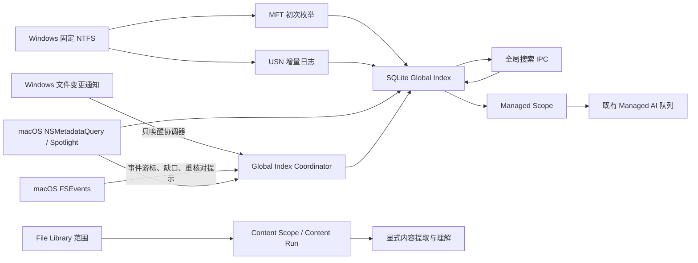

# Zen Canvas × Oil Find：搜索与索引架构深度审计

审计日期：2026-10-08
审计类型：源码级架构与性能审计；没有修改生产搜索、索引、Schema、IPC 或文件操作代码。

## 1. 基线、范围与证据等级

### 1.1 基线

| 项目 | 审计基线 |
| --- | --- |
| Zen Canvas | 远程 `origin/master`，SHA `b7ef92691a48bebbbc1d0ca2363b96a9d8244278`；本分支从该提交建立 |
| Oil Find | 远程 `main`，SHA `a4f685405a014f80d1773f2bd0baa7f3321b77e8`；审计前用 `git ls-remote` 核对 |
| Cloud 环境 | Linux x86_64；不是 Windows/macOS；3 CPU、约 9.7 GiB RAM |
| 在审 Open/Draft PR | PR #335，Draft：`[Draft] Fix onboarding scan-scope confirmation for #329`。本分支只增加研究报告，不触碰该 PR 的产品流程或范围确认代码 |
| 项目治理边界 | `docs/project/STATUS.md` 将 Post-#323 reconciliation 标为 Owner Gate、Specification Only，当前未授权生产实现。报告的实现建议是待 Owner 决策的研究结果，不构成新授权 |

Zen Canvas 仓库有一个当前 open Draft PR #335，内容涉及 scan-scope 确认，与“索引范围 / 用户配置”主题相邻。此审计只提交文档，因此不与其改动冲突。STATUS 同时记录 Windows Global Index 缺陷 #328、#329 仍独立 Open；审计没有更改其状态，也不把历史修复或测试记录当作这些问题已关闭的证据。

### 1.2 证据等级

- **源码可证实**：以下所有 Zen Canvas 和 Oil Find 行为均以审计基线上的源码、测试源文件为依据。Zen Canvas 引用使用仓库相对路径及行号；Oil Find 链接固定到上述 `main` SHA，避免后续 `main` 漂移。
- **自动化测试源存在**：源码包含该测试，不代表本次运行通过。测试是否执行及结果见第 6 节。
- **独立实测**：本次实际运行且记录环境的命令结果。前端搜索链路测试通过；补齐 GLib/GTK/WebKitGTK Linux 开发依赖后，Rust 构建因 Linux 下未解析的 `keyring` 引用停止，Rust 测试与合成基准均未启动；本次没有得到 Zen 或 Oil 的搜索时延、索引耗时或内存数值。
- **上游 README 数据**：只作为 Oil Find 作者在 README 中报告的数值，不视为本次复测或跨平台预测。

### 1.3 本次审计覆盖的 Zen Canvas 核心文件

- 平台发现与行来源：`src-tauri/src/global_index/windows/volumes.rs`、`windows/mft.rs`、`windows/usn.rs`、`windows/fallback.rs`、`windows/mod.rs`、`windows/service_host.rs`、`macos/spotlight.rs`、`macos/fsevents.rs`、`macos/mod.rs`。
- 共用索引、搜索与恢复：`global_index/coordinator.rs`、`repository.rs`、`search.rs`、`models.rs`、`managed_scope.rs`、`managed_worker_hardened.rs`、`global_index/tests.rs`、`global_index/hardening_tests.rs`、`global_index/lock_contention_tests.rs`。
- 持久化和受管扫描：`db/schema.rs`、`scanner.rs`、`path_filter.rs`、`content.rs`、`content/preview.rs`、`content/policy.rs`、`content/eligibility.rs`。
- 完整 UI→IPC→数据库查询链路：`src/components/CommandModal.tsx`、`spotlight/spotlightQueryController.ts`、`src/api/searchRuntimeApi.ts`、`global_index/commands.rs`、`global_index/search.rs`。
- 产品/治理边界：`docs/project/ARCHITECTURE_MAP.md`、`docs/project/MASTER_DEVELOPMENT_PLAN.md`、`docs/project/STATUS.md`、`docs/project/DECISIONS/0013-managed-ai-eligibility-and-queue-authority.md`。

## 2. 执行结论

1. **Zen Canvas 已经有平台原生文件发现，而不是通用全盘递归搜索**：固定 NTFS 卷走 MFT 初次枚举与 USN 增量；macOS 走 Spotlight 元数据与 NSMetadataQuery 更新，并用 FSEvents 发现事件缺口或请求协调器重核对。Windows/macOS 的原生运行效果在本次 Linux Cloud 中均为 **NOT VERIFIED**。
2. **普通文件名搜索已是元数据搜索，不调用模型**。全局搜索只查询 Global Index 的文件元数据，不依赖 Managed AI、内容提取或旧 `files` 表。搜索结果与 Managed Scope 状态分列；Content Run 又有独立的范围策略、预览、确认和内容可读性门禁。
3. **现有查询已有限界、索引和稳定排序，未发现源码证据证明应立即重写搜索核心**。它使用 SQLite 精确名/前缀/扩展名索引和 FTS5 trigram，最多取 4096 条候选、最多返回 200 条；产品输入目前请求 80 条。主要未知数是大规模冷/热查询、复合 FTS、写放大及设备差异，而不是缺少一个“高级算法”。
4. **初次索引的可疑成本更在文件系统及路径准备阶段**：Windows MFT 暂存后逐非目录文件调用 `symlink_metadata`，并为目录建立全路径 Map；目录路径解析可能重复扫描未解析目录。macOS Spotlight 结果也执行若干本地 metadata/stat/父身份读取。这些是静态代码层的成本假设，尚未在真实磁盘测量。
5. **不应直接把 Oil Find 的 SoA 持久索引替换 Zen SQLite，也没有足够证据引入 SIMD**。Oil Find 是 macOS 14+ Swift/C 实现，其紧凑内存模型与 FSEvents 更新适配其单一搜索工具。Zen 的 durable SQLite authority、平台分层和跨域文件身份关系不同。
6. **拼音目前不在 Zen Global Search 中**。若明确需要，应将其视为可选的 Rust 搜索能力，而不是从 Oil Find 复制 CoreFoundation 转换或默认生成新的大索引列。

## 3. Zen Canvas 现有实际架构

### 3.1 索引来源与后台工作

这与项目自己的架构图一致：Windows MFT/USN 和 macOS Spotlight 提供 durable rows；桌面文件事件/FSEvents 负责唤醒或重核对，不直接成为每行事实来源（`docs/project/ARCHITECTURE_MAP.md:201-204`）。

### 3.2 Windows：MFT、USN 和降级边界

- `discover_windows_volumes` 使用系统卷 API 识别盘符、卷标和文件系统；只有 **固定 NTFS** 默认启用 MFT/USN provider。其他文件系统保留为不支持/不可用状态；Removable 与 Remote 默认不启用（`windows/volumes.rs:14-37,40-111,151-171`）。代码实现的是 NTFS 优先路线，并没有 ReFS/exFAT 的等价 MFT 实现。
- 初次基线调用 `FSCTL_ENUM_USN_DATA`，枚举输出缓冲为 1 MiB。记录先写入临时 SQLite staging DB，关闭其 journaling/synchronous，建立 file-reference 与 parent-reference 索引；完成后再按序分页输出（`windows/mft.rs:124-149,152-221`）。这是批处理而非把每个文件建成完整 Rust 对象长驻内存，但需要 staging 磁盘空间。
- 目录记录全部载入 `Vec<MftRecord>`，`resolve_directory_paths` 为目录创建键/父引用到完整路径的 HashMap。随后逐条重建文件 path 并每 512 项向 sink 写批次（`windows/mft.rs:224-305,342-450`）。深层目录或大量目录可能带来多轮 unresolved 扫描和重复路径字符串；需要专门的深度/目录比例基准才能确定其实际成本。
- 非目录 MFT 项逐文件调用 `std::fs::symlink_metadata(&path)`，以取得 size 和 mtime，之后使用 512 项写批次（`windows/mft.rs:382-448`）。这使 MFT 元数据枚举之后仍有与文件数量近似线性的路径 metadata 访问；其 I/O 代价在冷缓存、大量小文件、权限拒绝或文件消失竞态下可能显著。不能简单删除这些 stat，因为 size/mtime 目前依赖它们或回退时间戳。
- USN 增量通过 `FSCTL_READ_USN_JOURNAL` 读取；删除、旧 rename name 会标 stale，upsert 根据 file identity/parent identity 解析路径并写入。USN journal ID 改变、游标超出历史、解析/游标不连续会将 source 标记 `rebuild_required`，避免悄悄接受日志缺口（`windows/usn.rs:92-176,193-258`）。目录 rename 可能导致全量 MFT 重建（`windows/usn.rs:129-163` 与 Windows provider 路由）。
- Windows `notify` watcher 是唤醒信号，路径不直接决定持久行。服务/直接 MFT-USN provider 才是索引权威。当前 `run_source_request` 在进入 service/direct 前会启动 watcher（`windows/mod.rs:234-310,425-489`）；虽然 watcher 被注释为“hint”，启动失败能否阻塞后端 route 应继续纳入 Windows 实机检查，不能仅依据注释认定完全解耦。Watcher 运行后失败会移除并在下次请求重建；相关测试源在 `windows/mod.rs:720-782`。
- `windows/fallback.rs` 有递归 `index_volume` 函数，但审计未发现 Windows 正常生产路由调用它。不能把它报告成 NTFS 原生失败后自动递归整卷的有效路径。生产 service 失败使用直接 MFT/USN provider；通用递归 provider 属于其他平台/测试路径。

### 3.3 macOS：Spotlight 与 FSEvents 的职责分工

- `MacosSpotlightProvider::discover_sources` 暴露一个 local-computer source。首次扫描先将 volume 旧行标 stale、清理内存身份映射、启动 watchers，再执行 Spotlight `NSMetadataQueryIndexedLocalComputerScope` 查询（`macos/mod.rs:390-420`；`macos/spotlight.rs:80-153`）。查询 run loop 以 0.2 秒窗口等待 gather，遍历结果并每 512 条回调持久化。
- 每项会从 NSMetadataItem 取 path/name/size/date，但还调用 `symlink_metadata(path)`、`file_semantics::inspect(path)`，并读取父目录 metadata 生成身份（`macos/spotlight.rs:400-475`）。这属于索引元数据处理，不读取文件内容。Spotlight 权限/外置卷覆盖率有专门健康状态探测，但外置盘未被 Spotlight 纳入时不等同于被成功索引。
- NSMetadataQuery added/changed/removed 通知形成普通增量候选。FSEvents callback 故意忽略事件路径的行事实，只更新最大 event ID；出现 MustScanSubDirs、user/kernel dropped、event ID wrapped、root changed、mount/unmount 等状况时设置 full reconcile 并唤醒协调器（`macos/fsevents.rs:91-135`）。因此 Zen **已经有 FSEvents**，但职责与 Oil Find 不同：Zen 借助 Spotlight 更新行；FSEvents 主要提示日志/覆盖缺口。
- Spotlight pending upsert/stale 集合上限为 4096 distinct identity；超限时丢弃待处理增量并改为 full reconcile（`macos/mod.rs:27-35,51-109`）。可控内存优先于无限增长；代价是突发大量变化可能扩大成一次完整 Spotlight reconcile。
- provider 的 `baseline_established` 是进程内原子状态；首次 provider cycle 或当前进程无 baseline 时会清 stale 并重新流式查询 Spotlight（`macos/mod.rs:397-449`）。启动 watchers 时带入持久 event cursor。持久 Global Index / checkpoint 可用于跨进程恢复状态，但“已持久化 cursor”不意味着 macOS native cold restart 已在本 Cloud 实测。
- macOS 的 Spotlight/FSEvents、Full Disk Access、外置盘行为、iCloud/File Provider 语义以及生命周期停止信号，都属于 **NOT VERIFIED**。跨平台 Rust 编译不会替代真实 macOS 验收。

### 3.4 SQLite Global Index 与搜索查询

- `global_entries` 持久化 `name/name_normalized/path/path_normalized/extension/size/timestamps/attributes/identity/source` 等每行 metadata，并有 volume、identity、name、path、mtime 等 B-tree 索引（`src-tauri/src/db/schema.rs:1655-1685`）。另有外部内容 FTS5 trigram 表 `global_entries_fts(name,path,extension)` 和 insert/delete/update 触发器维护（`schema.rs:1687-1710`）。这支持路径子串，但增加持久索引体积与变更写放大；具体磁盘/内存占用未测。
- `search_global_entries` 次序为精确文件名、名字前缀、精确扩展名、扩展名前缀、最后 FTS 或标点前缀；按 ID 去重。最终候选最多 4096，后台服务请求上限 200，offset 实际超 4096 会给空页；UI 请求上限 80（`global_index/search.rs:6-23,24-122`，`CommandModal.tsx:75,385-414`）。
- FTS 只在 query 至少 3 个字符时进入；全字母数字/空格查询使用 FTS5，包含标点的查询走字面 name prefix（`search.rs:94-115`）。没有 fuzzy edit-distance 或拼音索引。短查询仍能返回精确名、前缀、扩展名，但没有通用子串匹配。
- 精确名/前缀按 `modified_at_fs DESC, id ASC` 稳定排序；扩展名前缀低于主名称层；FTS 使用 `bm25` 名/路径/扩展名权重后再按 mtime、ID 排序（`search.rs:178-260`）。这是分层 relevance，不是 Oil Find 的逐文件内存 scorer。
- `global_search` request 是 query/limit/offset/cursor/requestId/version；没有目录范围、体积/日期过滤语义（`global_index/models.rs:152-165`、`global_index/commands.rs:10-69`）。File Library Query V2 的根范围和筛选是独立 authority，不应误称为 Global Search 能力。
- 每个命中的层会 `conn.prepare` 新 SQL statement（如 `search.rs:178-210,213-246`），代码没有应用层 LRU query cache 或连续输入候选过滤。SQLite 自身 page cache 仍然存在，不等于应用候选缓存。
- Repository 使用 SQLite transaction 做 entry upsert，并在同一事务中为受管 scope 检查潜在 Managed AI 工作（`global_index/repository.rs:185-253`）。Search snapshot 在同一个 read transaction 读结果和索引状态，避免 UI 用不同数据库时刻的数据做 complete/partial 判断；命令还比较 coordinator 与 DB 状态（`global_index/commands.rs:10-46`）。
- `name_normalized` 由 Rust Unicode `to_lowercase` 写入，而上述精确/前缀 SQL 使用 SQLite `lower(?1)`（`repository.rs:225-229`，`search.rs:185,201`）。SQLite 内置 `lower()` 的 Unicode 行为不等于 Rust 完整 Unicode case folding；测试覆盖是否有大小写非 ASCII 文件名需补证。当前不能据此宣告存在用户可见失败，也不应在未加回归测试前改变匹配语义。

### 3.5 UI→IPC→搜索返回、取消和排序

1. 输入先受 IME composition/committedSearch 管理；符合提交条件后设置 50 ms debounce，再调用 `tauriApi.searchGlobalEntries`（`CommandModal.tsx:375-420`）。
2. `SpotlightQueryController` 按 session 和递增 sequence 发 requestId，只接受最新 response，并根据 source revision 检测要不要 refetch（`spotlightQueryController.ts:3-37`）。
3. 前端 cleanup 会清 timer 并忽略已发出请求的 Promise；IPC facade 只有搜索 invoke，没有 search cancel 命令（`CommandModal.tsx:385-419`，`src/api/searchRuntimeApi.ts:8-12`）。所以它解决 UI 旧结果覆盖问题，不会终止已经开始的 SQLite 查询。
4. 后端同步 Tauri command 验证请求，读取 transaction snapshot，查询 SQLite，组合一致的 index/source health 状态后返回（`global_index/commands.rs:10-69`）。查询结果有候选界限，但缺乏本次测量的高频输入 CPU 和锁等待数据。命令是否会在特定 WebView/runtime 构型造成主线程卡顿，需要 native UI 配置复测；源码仅足以说明 handler 为同步函数、没有此处显式 `spawn_blocking`。

**结论**：现有前端延迟及结果一致性机制已具备；后台取消和增量查询没有实现。是否值得加要看 query p95/CPU，而不能只因 Oil Find 有此实现就改变 Zen 的 Search Window IPC/权限契约。

### 3.6 可发现、可搜索、可管理、可读内容和 AI 处理的边界

当前真实状态可分成五层，而不是“扫描=AI”：

| 层 | 当前 authority | 实际行为 |
| --- | --- | --- |
| 发现 / 普通搜索 | Global Index | 广泛的本地元数据发现；行包含 `is_hidden/is_system`，但这两个属性不等于排除标志。搜索不 join legacy AI `files` 表，也不因 AI 未启用而消失（`global_index/search.rs:13-23,149-160`） |
| File Library 管理 | Managed scan / File Library | `jwalk` 并行扫描，skip hidden、不跟随 symlink；修剪 macOS package；按目录名排除 `.git/.cache/node_modules/target/dist/build/...`（`scanner.rs:47-58,1235-1248`，`path_filter.rs:19-65`） |
| Managed Scope / AI metadata queue | Global Index Repository + 单一 durable `ai_jobs` + ManagedAiWorker | Scope path 和 local/cloud policy 是主要 admission 条件。初始 backfill 将范围内所有行标 managed，但一次最多创建 100 个 AI jobs；测试明确验证“管理所有 120 项，初始 job 100 项”（`managed_scope.rs:245-293`，`hardening_tests.rs:223-255`）。后续 Global Index upsert 经 `enqueue_ai_jobs_for_entry_with_scopes` 为 enabled scope 下文件写/重激活 metadata 工作；此 helper 未调用 File Library `path_filter`，也未依据依赖/构建目录名称做 low-value admission（`repository.rs:596-615,687-802`）。因此：初始 backfill 有限额，不代表之后的 Managed Scope 增量永远只排 100；大 scope 下依赖树可成为 queue candidate。Worker revalidates scope/provider/currentness 且经过现有 scheduler，但队列候选数不等于实时 API 调用数（ADR-0013 与 `managed_worker_hardened.rs`） |
| Content extraction | Content Scope Policy + Content Run/Artifact | 新 scope 默认 disabled、local/cloud 均拒绝；支持 `txt/md/csv/pdf_text/docx/xlsx/pptx`，有 per-file bytes/chars/pages/rows 边界（`content.rs:569-593`、`content/policy.rs:51-79`）。用户需先 preview 再 confirmed start；preview 要精确 scope/root/policy revision、列候选状态/预算，候选大于 10,000 延后 materialization（`content/preview.rs:3-78,143-220`、`content/policy.rs:81-95`）。
| 内容文件可读性 | content backend eligibility | macOS 对目录/package、symlink、iCloud 未本地化、File Provider、下载中、权限、未知可读性分别 block/reason；普通搜索仍可看到 metadata-only 项（`content/eligibility.rs:13-103`、`content.rs:3324-3375`）。

**重要差异**：File Library 扫描会剪枝依赖目录，但全局索引为了“搜索一切”不会套用同一拒绝表；这符合“AI 不分析不代表不能搜索”。真正的风险位于 broad Managed Scope 的 AI candidate admission，而不是普通搜索把 `node_modules` 显示出来。项目 ADR-0013 已清楚提出低价值 AI admission 与 searchable/managed/AI-readable 分离；STATUS 当前仍是 Owner Gate / Specification Only，不能由本审计越权实现。

## 4. Oil Find 当前源码研究

### 4.1 产品和平台边界

Oil Find 当前是 Swift 5.10/C 的 macOS app，Package 声明最低 macOS 14（`Package.swift:1-15`）；Zen 的目标包括 Windows 和 macOS 13+ Apple Silicon。Oil 源码大量依赖 Darwin、CoreFoundation、AppKit、Carbon、FSEvents、`getattrlistbulk`，不能直接编译成 Windows 实现。

README 表述“Apple M5 / 24 GB”测量，并给出默认范围 85 万文件、索引 3.0 秒、45 MB、readme 0.6 ms、拼音 0.3 ms、kind:image 3.9 ms；整盘 750 万为 27.2 秒、343 MB、readme 8.1 ms 等（[README 基准表](https://github.com/oil-oil/oil-find/blob/a4f685405a014f80d1773f2bd0baa7f3321b77e8/README.md#L22-L35)）。这是 upstream README 的 M5 实机报告，不是当前 Cloud 独立执行结果；扫描范围/文件分布也不能等同于 NTFS、Spotlight 或 Zen 的数据库测试。

### 4.2 源码机制、跨平台性与 Zen 差异

| Oil Find 机制和源码位置 | 源码证实的工作方式 / 性能依据 | macOS 依赖与移植难度 | 与 Zen 的差异与判断 |
| --- | --- | --- | --- |
| 紧凑 SoA：[`IndexStore.swift`](https://github.com/oil-oil/oil-find/blob/a4f685405a014f80d1773f2bd0baa7f3321b77e8/Sources/OilFindCore/IndexStore.swift#L4-L75) | 每属性单独的 `malloc` 数组：`nameOff,parent,sizeC,mtime,flags,depth,kind`；UTF-8 name 与拼音 key 各自放连续 byte blob。节点用 `parent` entry ID 串目录，完整路径按需从父链重建。读写用 `pthread_rwlock`；计算 `allocatedBytes`。减少每行对象、字符串与完整路径重复存储，查询可连续扫描。 | Darwin 与 pthread 可近似类比，但 Swift pointer/alignment/serializer/hash 与 Rust 容器/SQLite row 语义都需重写；跨层 durable identity、tombstone/currentness 也须重新证明。 | Zen SQLite 持久保存每行 full path 和 FTS 索引，不常驻所有 Rust 文件对象；不是把文件对象装在 RAM 做匹配。复制 SoA 作为唯一 authority 会打破 SQLite durable authority；只做派生只读 cache 也增加重建/失效复杂度。**先不改布局**。 |
| 批量枚举：[`Scanner.swift`](https://github.com/oil-oil/oil-find/blob/a4f685405a014f80d1773f2bd0baa7f3321b77e8/Sources/OilFindCore/Scanner.swift#L104-L157)、[`coilfind.c`](https://github.com/oil-oil/oil-find/blob/a4f685405a014f80d1773f2bd0baa7f3321b77e8/Sources/COilFind/coilfind.c#L238-L265) | 多 worker 共享目录任务队列；每 worker 有 256 KiB `getattrlistbulk` scratch buffer，批量取得 name/type/id/dev/mtime/size；避免每文件 `stat`；通过 `open(...O_NOFOLLOW)` 并验证目录 inode/device，防路径竞态；同时排除不允许设备、symlink 目录、依赖树与 package 内容。 | 依赖 macOS/Darwin `getattrlistbulk`/BSD attrs/SF_DATALESS；Windows 应使用 NTFS MFT/USN，Zen 已有；不能把该 C ABI 跨编译到 Windows。 | 此批量 metadata 方式值得作为思路对照：Zen MFT 已批量读记录，却又对每个文件 `symlink_metadata`，值得先计数/计时。Oil 的 API 不替换 MFT 或 Spotlight。 |
| SIMD/NEON：[`coilfind.c`](https://github.com/oil-oil/oil-find/blob/a4f685405a014f80d1773f2bd0baa7f3321b77e8/Sources/COilFind/coilfind.c#L11-L56) | AArch64 下用 NEON 同时比较 needle 首尾字节，生成候选 mask，再 scalar 验证；非 AArch64 有 scalar fallback。优化的是连续 UTF-8/ASCII byte substring primitive，不是索引、SQL、路径 IO 或所有 Unicode 搜索。 | NEON 只适用于 ARM64；Zen Windows/macOS 最终均可能是 ARM64，但 SQLite/系统 I/O、Intel/mac runner或统一结果语义仍另需分支。 | Zen 的查询由 SQLite B-tree/FTS 执行；SIMD 只有当 profile 证明 SQLite 查询外的 CPU 字符扫描是主瓶颈才值得实验。现无这样的 profile，**不引入 SIMD**。 |
| 并行搜索、缩小和取消：[`Searcher.swift`](https://github.com/oil-oil/oil-find/blob/a4f685405a014f80d1773f2bd0baa7f3321b77e8/Sources/OilFindCore/Searcher.swift#L187-L312) | 搜索完全在内存索引上按块并行 `concurrentPerform`；接收 cancellation closure，在 chunk 内检查；以上次 `SearchResult` 继续缩窄只在同一 store/version、选项相同、字符 query 单调增加且简单正向 name clause 时启用。其余情况完整搜索，保住正确性。结果进行分块 top-K/合并。 | 并行计算本身可用 Rust rayon / scoped threads，但要控制与已有 scheduler、SQLite connection/transaction、Tauri command thread 的交互。 | Zen UI 只丢弃过期结果，并无 backend cancel/narrow。可借鉴“严守 version 和 query 变换条件”的验证原则；不能不测就加旁路候选缓存。 |
| 查询 LRU：[`SearchCache.swift`](https://github.com/oil-oil/oil-find/blob/a4f685405a014f80d1773f2bd0baa7f3321b77e8/Sources/OilFindCore/SearchCache.swift#L4-L84) | 精确 query/options/store identity/version 为 key；不缓存 time-dependent query；默认最多 32 条和总 4,000,000 result IDs；10 分钟过期；索引版本改变即清 stale 条目。 | 纯 Swift 实现容易借鉴成语言无关约束；但 Zen 需要尊重 DB source revision、volume状态与结果 state，key 不能只用输入文字。 | Zen 没有应用层缓存。可以在 query benchmark 后评估，但可能重复保存多个结果 ID；先测 DB page cache 能否满足目标。 |
| 拼音 key：[`Pinyin.swift`](https://github.com/oil-oil/oil-find/blob/a4f685405a014f80d1773f2bd0baa7f3321b77e8/Sources/OilFindCore/Pinyin.swift#L4-L51) | 懒初始化覆盖 U+4E00…U+9FFF 映射，用 `CFStringTransform(MandarinLatin)` 去音标，建全拼/首字母连续 key blob；`Searcher` 也可关闭该选项。 | 使用 Apple CoreFoundation 中文转换；输出/多音字策略依赖 Apple 转换与单字符映射，不是可直接用于 Windows 的 Rust 跨平台字典。 | 功能对中文用户可能有价值，但 Zen 目前没有该语义，直接加 key 影响内存、排序、测试及持久化/Schema。应等产品选择后以可选纯 Rust 规则实现，验证多音字/字词规范，不默认把所有中文转换成本加到索引。 |
| FSEvents 更新：[`FSWatcher.swift`](https://github.com/oil-oil/oil-find/blob/a4f685405a014f80d1773f2bd0baa7f3321b77e8/Sources/OilFindCore/FSWatcher.swift#L13-L73)、[`IndexUpdater.swift`](https://github.com/oil-oil/oil-find/blob/a4f685405a014f80d1773f2bd0baa7f3321b77e8/Sources/OilFindCore/IndexUpdater.swift#L94-L100) | Watcher 保存 event ID、收集 path/flags/change ID，history replay 后异步应用；drop/wrap/root 事件触发 rescan；IndexUpdater 对文件 identity/hash 更新，目录事件批量扫描 subtree，tombstone、sweep、阈值 compaction。 | FSEvents 是 macOS only；外置/network 设备过滤及历史恢复边界须按源重建。 | Zen 已有 FSEvents + cursor 与强一致的 Spotlight/SQLite authority，但 normal rows 来自 NSMetadataQuery，FSEvents 主要发现 gap。不要为了“模仿 Oil”改成独立 FSEvents row authority。 |
| 原子快照与启动恢复：[`IndexManager.swift`](https://github.com/oil-oil/oil-find/blob/a4f685405a014f80d1773f2bd0baa7f3321b77e8/Sources/OilFindCore/IndexManager.swift#L55-L125)、[`IndexStore+Persistence.swift`](https://github.com/oil-oil/oil-find/blob/a4f685405a014f80d1773f2bd0baa7f3321b77e8/Sources/OilFindCore/IndexStore+Persistence.swift#L14-L105) | fingerprint/root/device UUID 相符则 load binary index 快速可用，再由 saved cursor replay；扫描前取得 FSEvents current ID，完整扫描后从该 ID 建 watcher。保存写 `.tmp`、fsync、rename；load 先检查魔数/版本/count/长度/parent/index offsets，再 mmap 读取并重建 hash。 | Darwin `mmap/statfs/fsync/rename`；Rust 同有 POSIX 原语，但 Zen 应继续 SQLite 事务/WAL、不能多一套文件恢复 authority。 | Zen 的每批持久 SQLite 与 journal/cursor 已承担恢复职责；值得借鉴的是配置 fingerprint、watcher 启动前后衔接、validation 设计，不能再加入 `.oilfind` 平行快照。 |
| 目录过滤与 coverage：[`IndexConfig.swift`](https://github.com/oil-oil/oil-find/blob/a4f685405a014f80d1773f2bd0baa7f3321b77e8/Sources/OilFindCore/IndexConfig.swift#L3-L90) | 默认排除系统/缓存路径、依赖目录、部分 Library 与 package 内部；设置可显式开启 dependencies/packages/user Library/system；用户排除路径参与 config fingerprint；coverage reason 可解释某路径为什么缺失并给样例。 | 过滤规则是 Mac path 语义；设备 UUID/APFS backing、Library container、package bundle 都需平台处理。 | Zen 全局发现不排依赖树，managed File Library 有目录过滤；AI eligibility 是第三层。可借鉴“不同目的各有 visibility/explanation”，但不可将默认 exclusion 同时套进搜索，避免隐藏开发项目文件。 |
| 交互与快捷键：[`AppDelegate.swift`](https://github.com/oil-oil/oil-find/blob/a4f685405a014f80d1773f2bd0baa7f3321b77e8/Sources/OilFind/AppDelegate.swift#L40-L53)、[`SearchViewController.swift`（输入调度）](https://github.com/oil-oil/oil-find/blob/a4f685405a014f80d1773f2bd0baa7f3321b77e8/Sources/OilFind/SearchViewController.swift#L25-L35)、[`SearchViewController.swift`（取消与结果提交）](https://github.com/oil-oil/oil-find/blob/a4f685405a014f80d1773f2bd0baa7f3321b77e8/Sources/OilFind/SearchViewController.swift#L158-L208)、[`SearchField.swift`](https://github.com/oil-oil/oil-find/blob/a4f685405a014f80d1773f2bd0baa7f3321b77e8/Sources/OilFind/SearchField.swift#L1-L20) | Carbon 默认 Shift+Cmd+F 全局快捷键，可配置；原生浮窗输入变动后把查询放到独立 userInteractive queue；generation token 使旧查询取消/不呈现；返回主线程更新结果；原生 IME marked text 期间不拦键。 | Carbon/AppKit/NSTextView 是 Mac only。 | Zen 有 own Tauri Search Window、50ms debounce、requestId stale protection、IME commit 测试。Oil 的后台 query queue / cancel 是可参考的调度形态，但 Zen 的 Tauri权限和生命周期必须保持现有边界。 |
| 测试与 bench：[`Tests/OilFindCoreTests`](https://github.com/oil-oil/oil-find/tree/a4f685405a014f80d1773f2bd0baa7f3321b77e8/Tests/OilFindCoreTests)、[`main.swift`（bench 与 stats）](https://github.com/oil-oil/oil-find/blob/a4f685405a014f80d1773f2bd0baa7f3321b77e8/Sources/oilfind-cli/main.swift#L12-L65)、[`main.swift`（typing benchmark）](https://github.com/oil-oil/oil-find/blob/a4f685405a014f80d1773f2bd0baa7f3321b77e8/Sources/oilfind-cli/main.swift#L180-L199) | 有 scanner 对 naive/FileManager 的对照、持久化/重放/增量更改/窄化 vs full search/Unicode fuzz/取消/覆盖率/UI 测试。CLI 输出 entry count、scan time、allocated bytes、resident/RSS；query bench 20 次取 min/median/p95，typing bench 20 次走 cache/narrow。 | 测试和 CLI 依赖 Swift/macOS，使用真实 OS API 的 live test 不能在 Linux 代跑。 | 测量结构值得借鉴：把查询时延、typing 序列、RSS、index time 与变更延迟分开，并同时测 correctness。Zen 目前虽有 ignored DB 基准，却不覆盖完整生命周期且本次没能运行。 |

### 4.3 Oil Find 的测试证据与测量局限

代表性源码测试包括：`M1Tests` scanner 与 FileManager fixture 对照、拼音/排序/路径；`M2Tests` 文件变更、offline replay、fingerprint invalidation、并发保存搜索；`M5Tests` incremental narrowing 与 full result 对照；`M7SearchTests` 固定种子 Unicode fuzz 和 cancellation；`M7LiveTests` rescan/event 恢复与批量 merge；UI 的 Search editing / selection / refresh 测试。它们说明有覆盖面，不等于本次测试通过。

Oil Find CLI `bench` 会对固定 query 执行 20 次并报告 min/median/p95；`typing` 序列逐字符增长并可用 cache/narrow，`stats` 输出 arrays/entry、memory 与 peak RSS（`Sources/oilfind-cli/main.swift:12-29,46-65,180-199`）。README 的 20 次中位数属于作者报告的特定 M5 数据。由于本环境没有 `swift`，Oil 的 core/UI/live tests 与 CLI 均为 **NOT RUN**。

## 5. 源码级对比矩阵

| 维度 | Zen Canvas 当前实现 | Oil Find 当前源码 | 差距 / 正确分类 | 建议 |
| --- | --- | --- | --- | --- |
| 初次索引 | Windows MFT 临时 SQLite staging、目录路径 Map、逐文件补 metadata；macOS local-computer NSMetadataQuery；每 512 条写数据库 | 多 worker + `getattrlistbulk` 批量 metadata；构造 SoA 与内存 hash | **Windows 有高风险线性 per-file stat 与目录全路径状态；macOS 使用 system metadata source。** Oil 批量 API 仅 Mac 可用 | 对 MFT per-file metadata 操作和 directory resolver 分阶段量测；先定位占比再做优化 |
| 增量索引 | Windows USN journal ID/cursor；macOS Spotlight delta + FSEvents gap/full reconcile；pending Mac identities 上限 4096 | FSEvents path list + event cursor 回放；IndexUpdater identity 更新目录子树 | 两边已有实时增量和异常重扫。Oil 的 event path 写行与 Zen row source 职责不同 | 保留平台分工；比较 drop/outage 后多久 reconcile 与数据库增量写成本 |
| 搜索算法 | SQLite 精确名、前缀、extension tiers、FTS5 trigram；标点走 literal prefix；稳定权重顺序 | 对所有条目并行扫描/计划过滤，C matcher scoring，top-K merge | Oil 支持更复杂 query / relevance；不等于对 Zen 的 SQLite+FTS 可直接更快 | 先以 Zen SQL plan +实际 p95 验证；无需按功能数对标 |
| 内存布局 | durable SQLite 行和 B-tree/FTS；每次查询 bounded Vec/HashSet，未构造一个全局 Rust row cache | 紧凑 SoA、name blob、parent id、hash 表，完整路径按需构建 | Oil 内存密集且省重复 path/object；Zen 可持久查询但 SQLite/Fts 占盘与cache | 不替换 durable authority；需 profile 再实验 derived cache，单独核对冷启动/invalidations |
| 查询缓存 | 无显式 app LRU；SQLite connection/page cache；每次 query 准备需要的语句 | 32 query / 4m result ID 缓存上限，10 分钟过期，排除时效 query | **缺少 app query cache / narrowing**；但是数据库已做索引且请求候选有上限 | 后端基准通过后，再做有 version/revision key 的限额缓存或候选缩窄试验 |
| 拼音匹配 | Global Search 无拼音；搜索请求无 pinyin flags | `CFStringTransform` 建全拼和首字母 key；可设置开启 | 功能缺失；Oil 实现绑定 CoreFoundation 且多音字证据需单独看 | 产品明确需要时做 optional Rust implementation；先词例、排序、资源预算 tests |
| 文件变化监听 | Win watcher wake；macOS FSEvents gap signal + NSMetadataQuery 行事件 | FSEvents 按路径直接驱动增量 | 两者都有 watcher/恢复，但 row authority 不同 | 不把 Oil FSEvents 移作 mac row authority；测试事件 overflow 与 cursor 恢复 |
| 异常恢复 | SQLite 状态+USN journal cursor；cursor invalid要求 MFT rebuild；mac event cursor、pending overflow请求 reconcile | `.oilfind` atomic binary snapshot + config/root/device/event cursor 校验，drop/wrap rescan | 两种持久化方案。Oil snapshot很好，但不替代 SQLite事务和跨功能文件库 | 借鉴配置指纹/游标衔接/损坏输入校验，不新增第二持久化 truth |
| 目录排除 | Global Index 保持可发现；Managed scanner 剪枝系统/依赖目录；AI Scope 当前主要按目录策略 | Global index default exclude system/cache/package/dependencies；可设置启用和用户排除 | Oil 是“轻 launcher”的目录策略；Zen 按产品目标需搜索开发资产 | 保留搜索可见性；为 AI admission 单独做有解释的低价值优先策略，需 Owner 授权 |
| 索引覆盖率 | volume/source status、permission/Spotlight/external-not-indexed 状态、计数与 last error；缺 path 级通用 excluded-by-reason report | CoverageStats 分类 reason，保存计数与有限样例，路径 explain | Oil 的用户解释和覆盖样本更细 | 可研究只读 coverage diagnostics，不让局部计数代表全盘 complete |
| UI 响应 | IME commit、50ms debounce、80 条 limit、latest requestId 防过时回写；无 backend cancel | 独立高优先级 search queue、generation cancel、LRU/narrowing、原生键盘/quick look | Zen 已有输入和结果正确性；后台旧查询仍可能运行 | 只有证明高频输入 CPU/时延时再设计后台可取消查询，保持 IPC 权限和窗口生命周期 |
| Windows 适配 | 固定 NTFS MFT/USN；其他文件系统 default unsupported/unavailable；Removable/Network默认关闭 | 无 Windows 实现；Darwin + NEON source | **Oil 无可移植 Windows provider** | Zen 保留 MFT/USN 原生实现，关注日志失效/卷边界和非 NTFS truthful status |
| macOS 适配 | Spotlight metadata + NSMetadataQuery updates + FSEvents gap，Full Disk Access / external 状态 | AppKit/Darwin + bulk attrs + FSEvents；最低 macOS 14 | Zen 与 Oil 都 Mac native，行为不同；目标支持版本不同 | 对 Zen 现有路径做 owner实机验收；不能以 Oil 或 Linux结果推断 |

## 6. 测试与性能基准验证

### 6.1 Zen 仓库已有测试/基准

1. `src-tauri/src/global_index/tests.rs` 有常规搜索正确性测试：精确名/前缀/扩展名排序、无重复、标点字面行为、分页稳定、FTS 补满、stale/disabled source 排除、search snapshot 一致性及 AI policy 对搜索可见性的独立性。
2. 该文件已有两个 `#[ignore]` 合成数据库性能测试：
   - `global_search_performance_100k_synthetic_entries`：递归 CTE 合成 100,000 rows，关闭部分 insert/count trigger 后重建 FTS，5 个 query × 3 次测量，先各热身 2 次，最终只统计 15 个样本的 p95；阈值 100ms。样例涵盖短查询、精确名、扩展名和标点。
   - `global_search_performance_one_million_synthetic_entries`：合成 1,000,000 rows，关闭部分 trigger 后重建 FTS；5 个 prefix query × 3 次，共 15 个样本，无 100k 测试中的显式 warmup；阈值同为 100ms。
   两项均为 SQLite synthetic seed，不创建真实文件，不测 MFT/Spotlight 扫描、index wall time、RSS、rename/delete write latency、查询期间 CPU、事件恢复，也没有 500k/5m 档。这两个测试在本次未能编译运行，因此本报告没有 Zen 查询实测值。
3. `src-tauri/tests/fts_benchmark.rs` 是 File Library FTS benchmark，不是 Global Search 基准；`tests/file_library_performance.rs` 测 File Library query/migration，也不能当作 Global Search 的证据。
4. `global_index/lock_contention_tests.rs` 源码用第二 SQLite writer synthetic `BEGIN IMMEDIATE` 重现 5 秒 busy timeout，并检查 WAL read observer 不阻 writer；测试本次因同一个 build dependency 未运行。这与 STATUS 中 #328/#329 独立开放缺陷相关，但不能用此 fixture 等同实机 issue reproduce。Windows 原生 #328/#329 结果仍依 Owner 记录。

### 6.2 本次实际运行结果

| 命令 | 实际结果 | 解释 |
| --- | --- | --- |
| `npm test -- tests/spotlightQueryController.test.ts tests/searchSpotlight.test.ts` | **PASS**：2 files、25 tests passed，1.26s | 验证 UI stale request guard、Search Spotlight 查询交互合同等前端测试；不测实际 Tauri/SQLite/平台 API |
| `cargo test --manifest-path src-tauri/Cargo.toml --lib global_index::tests -- --nocapture` | **BLOCKED**：安装临时 Linux sysroot 原生依赖后，crate 编译于 `src/ai/settings.rs:602` 等处报 `E0433: keyring` 未解析 | 当前 Linux target 不在 credential backend 的 Cargo target dependencies 中，但该模块仍无条件引用 `keyring`；Rust 单测及两个 ignored benchmark 未启动 |
| `swift test`（在 Oil Find checkout） | **NOT RUN**：`swift: command not found` | Oil 的 macOS core/UI tests 和 CLI 无法在此 host 执行 |

Cargo 使用仓库 `rust-toolchain.toml` 自动安装的 Rust 1.97.1。按请求安装的 GLib 2.84.4、GTK 3.24.49 和 JavaScriptCoreGTK 2.52.6 开发依赖解包在 `/tmp/zc-audit-sysroot`；没有修改 Cloud 系统目录。依赖检查通过后，项目 crate 因 `keyring` 只在 `Cargo.toml` 的 Windows/macOS target dependencies 下声明、而 `src/ai/settings.rs:602-659` 在 Linux 构建时仍无条件引用它而停止。此 Cloud 构建可运行性限制不证明 Windows/macOS 编译有缺陷。本审计没有临时修改 manifest 或生产代码绕过它，因此后端单测和 ignored benchmark 未执行。

### 6.3 性能数字、界限与下次基准方案

- **Zen 本次实测**：无。查询 p50/p95/p99、索引耗时、RSS、CPU、增量延迟在报告中均标为 **NOT MEASURED**。
- **Oil 本次实测**：无。README M5 数字仅是 upstream reported results，不是 Cloud/Linux/Zen 的 performance evidence。
- **平台结论**：所有 NTFS/MFT/USN/FSEvents/Spotlight/macOS privacy/APFS/native UI 的真实表现均 **NOT VERIFIED**。Linux x86_64 结果不能解释成 Windows 或 macOS 性能。
- 下一次可运行时，优先扩充现有 ignored Global Index benchmark，而非另造 benchmark authority：按 100k/500k/1m/5m 合成 rows 重复 query 30-100 次，分别报告 exact/prefix/FTS/标点/中文三字以上/扩展名；记录 warm/cold page cache、p50/p95/p99、results correctness、`EXPLAIN QUERY PLAN`、SQLite file size、process RSS 和 CPU。写入 side 单独量 10k/100k inserts、rename/move、批量 delete/stale 与 FTS trigger 开关对照。合成 DB 结果要明确标 synthetic；真实文件系统阶段由 Owner Windows/macOS验收记录提供。
- Windows 原生需另外量 MFT枚举、目录路径resolve、每文件metadata读取、SQLite持久化四段；变更样本含 rename/move directory/file、批量 delete、USN日志失效与退出重启。macOS需另记 Spotlight gather/query、metadata_item_to_entry、batch write、FSEvents drop回补与权限/覆盖率。

## 7. 正确性、稳定性和性能风险

| 风险 | 证据和影响 | 级别 / 状态 |
| --- | --- | --- |
| Windows 首次索引每个文件额外 metadata 访问 | MFT batch 已有 identity/name/attributes，但每非目录仍按 full path `symlink_metadata` 取 size/mtime（`mft.rs:382-448`）；小文件海量卷可能使 I/O/路径解析主导。 | **P1 candidate**，性能未测；不得未经 Windows evidence 删除字段或换 metadata source |
| Windows 目录 path resolver 峰值状态与深层复杂度 | 所有目录记录进 Vec，构建 full path map；反复遍历 `unresolved` 直到没有推进（`mft.rs:224-305`）。极深/父记录排序不利时可能放大 CPU 与临时 RSS；目录路径字符串也有前缀重复。 | **P1 candidate**，需构造乱序父链/真实 volume 测深度和目录比例 |
| 每行 metadata 同时维护多个 SQLite 索引与 trigram FTS | 写 entry 后 insert/update trigger 写 FTS；name/path 查询索引、identity、mtime 等并存（`schema.rs:1676-1710`）。首次导入或rename可能产生写放大/磁盘体积。 | **P1 measure**，未做 SQLite page/file size 和吞吐测量；FTS 是当前查询能力的正确性组件 |
| 高频键入时旧查询在后台继续运行 | UI 只 debounce 50ms/丢弃旧 Promise，不发后端 cancel；query每次可依次准备/执行多个 tiers，候选上限虽有界（前端/搜索源码见第 3.5）。 | **P2 pending measurement**；不能推论当前主线程已卡顿 |
| Global Search 没有通用 path/size/date filter，也无 fuzzy/pinyin | request/API 及 SQL 证实未定义这些语义；File Library query 属另一 surface。短于 3 字符只走精确/前缀/extension tiers。 | 产品能力差异，不是搜索索引正确性缺陷；是否增加需产品决策和契约更新 |
| Unicode uppercase normalization 需测试 | Rust `to_lowercase` 与 SQLite builtin lower 能力域不同；非 ASCII uppercase query 可能绕过精确/前缀。 | **P1 correctness test candidate**；实际 affected examples 尚未运行验证，先加只读回归测试再决策 |
| Global Index rows 与 Managed AI queue eligibility 仍有粗粒度差异 | File Library scan prunes dependency dirs，但 global entry upsert 的 AI queue helper 按 enabled scope path admission，不查忽略目录；增量命中时可能创建大量低价值 AI queue candidates（`repository.rs:687-802`）。initial backfill 100-job cap 不是永久上限。 | **P1 product/cost gate**；需按现有 ADR-0013 / #330 Owner gate 实施；不是本审计的生产改动授权 |
| 外部卷/权限覆盖率不是完整 pathname explainability | Windows仅支持默认 fixed NTFS；macOS source reports Full Disk Access / Spotlight not indexed / external not indexed；Oil另有更细的 per-path exclusions/coverage sample。 | 产品覆盖边界与可解释性差距；平台状态本次 **NOT VERIFIED** |
| macOS event overflow/full Spotlight reconcile成本 | 4096 pending 集合上限溢出即切 full reconcile；FSEvents dropped flags也请求全量对齐。正确性倾向 fail safe，但变更风暴时可能产生大扫描工作。 | 稳定性保护已实现；重扫时间/资源未测 |
| 后端搜索同步调用的调度影响 | Tauri handler 直接调 sync snapshot search，无显式 cancel/blocking pool。结果最多 4096个候选，但实际 Tauri bridge 在目标平台上的线程行为未测。 | 调度风险假设，不是主线程冻结结论；需要平台交互 trace |
| Cloud Linux 无法编译当前 crate 来运行 Global Index 测试 | `Cargo.toml:75-100` 仅给 Windows/macOS 添加 `keyring`，但 `ai/settings.rs:602-659` 在该 Linux build path 仍使用 `keyring`；本次实际编译返回 E0433。 | **验证可运行性限制**，仅适用于本次 Linux Cloud 测试路径；不能据此推断受支持 Windows/macOS build 失败 |

## 8. 专用优化方案及复用判断

### 8.1 极速文件发现与共用核心

- 继续让 Windows MFT/USN、macOS Spotlight/FSEvents 保持平台差异；索引身份、结果 tier/排序、source status、错误与测试契约留在共用 Rust repository/query。
- 对 SQLite 查询先做实际 query plan 和 p95/p99；对初次扫描分段计时。若 Global Search SQL已经低延迟，重点不要放在 matcher SIMD。
- 如果 benchmark 显示 query CPU 而非 DB/IO 主导，最小试验依次为：复用 prepared statement（当前层每次 `prepare`）、基于 revision/option 的小额 LRU、满足严格单调扩展的候选缩窄。每个试验与当前 search path并存，先用结果集合等价测试验证，不改 IPC语义。
- SoA 只能先作为短命、可重建的派生 read-cache 原型，不得取代 SQLite行与索引持久化。任何双写/缓存一致性都需以 source revision invalidation、crash reload、volume rebuild、stale row、permission状态测试证明；若这项复杂度超过 SQLite p95收益则不做。
- SIMD 暂缓。Oil 仅优化纯字节匹配；Zen FTS5 trigram和B-tree查询已有 C/SQLite执行路径。只有 benchmark 明确显示 Rust/SQL之外的字符比较CPU占主导时，才单独 benchmark portable scalar 与平台 SIMD，并比较 Windows ARM64/x64、macOS ARM64 correctness 与功耗。

### 8.2 搜索显示、提取资格和 AI 资格分别决策

推荐持续遵守以下政策模型，作为现有 authority 的策略维度，不建议在本任务加新 Schema：

| 维度 | 默认行为 | 示例 |
| --- | --- | --- |
| **Search visibility** | Global Index 可以发现并按用户查询显示；不因 AI exclude 隐藏 | Downloads、用户 Documents、图片/视频、dev project、依赖目录可以按搜索策略保留 |
| **Content extraction eligibility** | 只对用户选定 File Library scope / 候选走 Content Scope Policy、格式/大小/内容可读性校验及 preview/confirmed run | 文档/下载目录启用 txt/pdf/office text；iCloud 未下载/未知权限提供具体 blocked reason |
| **Managed AI metadata eligibility** | 限于启用 Managed Scope 和 provider policy，在队列 admission 按确定性文件价值与预算筛候选；复用现有 `ai_jobs` / Worker / scheduler | 项目根保留目录语境，优先 README、项目 manifest、用户显式选中文件；依赖树/构建产物默认 deferred/excluded from AI admission，但仍可搜索 |
| **AI organize/cleanup decision** | 保留已经确认的 AI-only 决策原则；AI 提供含义/分类判断，用户 review、preview、安全执行 authority 仍然分离 | 不因低价值排除把文件标为可删除；不把 AI 资格赋权为文件操作 |

对 Download、Pictures/Videos 与 developer projects 的推荐是“搜索默认可见、内容提取按文件类型/显式 run、AI metadata按低成本分层资格”，而不是全部纳入或全部隐藏。策略 UI 必须能说明某文件“为什么可搜索但没有内容分析/AI任务”。用户显式指定路径/项目、开发者搜索依赖目录时，应覆盖一般 AI 低价值规则的搜索显示，但仍受原 Content scope/provider consent 与文件安全政策约束。

ADR-0013 的 direction（eligible-now / reuse / deferred / policy-excluded 与复用同一 queue）与此一致；STATUS 当前的 Owner Gate 明确没有授权 implementation。不得以本报告新增 eligibility 表、第二队列、后台轮询或生产路径过滤器。

### 8.3 Windows、macOS 与共享实现

**Windows**

- 保持固定 NTFS MFT baseline + USN incremental。native 实机需量 MFT enum→staging→path resolver→per-file metadata→SQLite FTS 的阶段成本。
- 对非 NTFS（ReFS/exFAT/FAT）、removable、network/NAS 保持 truthful unavailable / opt-in/manual refresh 决策；不可悄悄退回递归全卷扫描。
- 比较 direct provider/service route、USN journal rollover/discontinuity rebuild、服务/通知停止再启动、权限/volume removal/reconnect。MFT path stat优化必须经 identity/time/size一致性对照。

**macOS**

- 继续将 Spotlight 作为 local metadata行来源、FSEvents 作为 gap/cursor/full reconcile authority；核验 NSMetadataQuery 更新删除、Full Disk Access、外置 APFS 与 Spotlight未索引卷、iCloud/File Provider placeholders。
- 真实 macOS 上量 `NSMetadataQuery` gather time、entry metadata conversion/stat 数、FSEvents overflow recovery、rescan/idle resource。macOS最低支持版本是 13+，所以不能依赖 Oil Find macOS 14+ 才有的API。
- 原生 Preview 是现有独立 File Library Preview path；Oil Search 的 filesystem search 结果不能自动授予 preview读取权。Preview仍使用 Zen的 byte-read eligibility/consent authority。

**共享核心**

- 统一 query grammar only if产品明确；当前两者语法/排序不同，不建议此时加 `path/ext/size/date/fuzzy/pinyin` 到现有 IPC。
- 共享文件 identity、结果状态、stale/rebuild、错误 code、稳定排序与 synthetic DB tests；平台API只供 metadata facts。
- 保持 coordinator/resource scheduler wake semantics和 lifecycle边界；不新增静态轮询或永久文件 watcher循环。

### 8.4 AI 成本控制判断

- 普通文件名/路径搜索继续只读 Global Index；不会调用模型。Content extraction不是 Global Search前置条件。
- 当前 Manage Scope admission 与 File Library path filter不是同一策略。后续有授权后应在既有 AI job canonical admission points统一生效：initial backfill、Global Index incremental enqueue、explicit semantic consumer等，不能只把 100 cap加大或只过滤 scanner。
- 低价值 default admission仅影响 AI queue，不影响 Global Index/Search显示，不改变 cleanup语义，不自动认定 safe-to-delete。
- 先 reuse current semantic assessment、做 metadata deterministic filtering、评估 scheduler budget，再 enqueue model作业；不能把所有 discovered metadata直接变成模型任务。
- 不创建第二 queue/worker/eligibility polling表；按当前治理决策复用既有 Managed AI queue、Worker、WorkScheduler和专门的 Content/cleanup consent domains。

## 9. 应借鉴与不应移植的机制

### 值得借鉴的五项

1. **条件严格的增量查询**：只在同一索引版本、相同过滤选项、简单正向 query 单调扩展时窄化；其他情况完整查询。可减少连续输入重复工作，且正确性条件写进 `canNarrow` 和对应测试。
2. **backend cancellation + latest-generation 交付**：Oil 的搜索放独立高优先级队列，在每个 chunk检查 generation cancellation。Zen 目前只防止旧结果入 UI；如实测证明旧 query 重叠造成 CPU浪费，再按既有IPC/权限合同设计取消，不要先加接口。
3. **版本绑定、严格预算的 query cache**：store identity/version/options为key、不缓存时间依赖查询、限制entries及结果 IDs。Zen可按 source revision / index revision 重新设计相同约束。
4. **覆盖率原因可解释**：Oil 不只排除目录，还显示 exclusion reason、样例和路径 explain。Zen可从只读诊断角度考虑路径级“未进入AI/未被系统索引/权限不足”解释，同时保留 searchable 与 AI eligibility 分离。
5. **把性能基准拆开并同时验证等价性**：query时延分位数、连续输入、内存、scan/update阶段和 correctness分别测量；合成与真实 filesystem分开。Zen当前 ignored测试有起点，但未覆盖这些维度且本次构建被阻断。

### 不建议直接移植

- 用 SoA/二进制快照取代 SQLite Global Index；这会增加第二持久 authority、重放/同步/Schema替代关系、stale row及 cross-domain 查询复杂度，可能破坏已经确定的 Zero-Burden/lifecycle与 durability约束。
- 把整个全盘搜索改成 Oil 的 macOS `getattrlistbulk`/Darwin/FSEvents implementation；它不可在 Windows复用，且 Zen 已有更适合各 OS 的 MFT/USN和Spotlight。
- 立即引入 ARM NEON/C SIMD；未证明搜索CPU是主耗时，硬编码优化会增加跨架构维护与 Unicode风险。
- 无确认将 CoreFoundation 拼音转换加入每个索引文件；会产生额外 key存储/启动转换、Apple行为依赖和多音字歧义。可作为独立、可选产品能力评估。
- 将系统/cache/dependency exclusion从 AI admission扩展为全局搜索隐藏；开发者显式搜索 node_modules、构建产物或 vendor 内容是有效用例。
- 把 normal Spotlight metadata event与FSEvents path stream混成新的行 authority；Zen 已有 DB/source/status一致性合同，event notification 是提示，不应变 durable truth。

## 10. 优化清单、复杂度和独立任务拆分

当前没有源码或执行证据支持紧急重写。下面是待 Owner 择优的最小任务拆分；优先级表示研究建议，不改变当前 #330 / ADR-0013 authorization。

| 优先级 / 任务 | 涉及位置 | 复杂度、风险、预期收益 | 独立实施 / 验收条件 |
| --- | --- | --- | --- |
| **P0 · 当前无生产代码修复可由本审计证明；先补平台证据** | `global_index/windows/{mft,usn,mod}.rs`；`global_index/macos/{spotlight,fsevents,mod}.rs`；Owner native evidence | 复杂度：验收；改错平台恢复路径的风险高。可确认既有真实性和 #328/#329界限，减少错误重构。 | Owner 在真实 Windows/macOS host完成第 11 节用例；未通过/未执行项继续显示 NOT VERIFIED；不要用 Cloud结果替代。 |
| **P1 · 运行并扩充 Global Search 合成基准** | 当前 `src-tauri/src/global_index/tests.rs:1060-1380` 的 ignored 100k/1m tests | 复杂度：低-中；风险低，不改生产语义。收益是为是否 cache、SQL或内存改造建立p95/p99、plan、数据库体积基线。 | 独立 benchmark only；保留测试侧 trigger/PRAGMA说明，加入500k、p99样本和 query correctness；在可构建host运行并保存 exact commit/env；真实磁盘单独验收。本次 Rust crate 在 Linux 因未解析的 keyring 阻断，因此未运行，也没有新增未经验证的 benchmark 代码。 |
| **P1 · AI queue低价值资格设计/实现决策** | `global_index/repository.rs:596-802`、`managed_scope.rs:245-293`、现有 `path_filter.rs`；主管ADR-0013/#330 | 复杂度：中-高；风险：AI结果/currentness/explicit user scope；收益：避免宽 Managed Scope 产生无价值 AI metadata工作与用户困惑。 | 先由 Owner 完成 #330 Gate明确policy和初始/增量/manual producers；下一独立 task 为 eligibility plan与contract tests；再经专门授权实现，不能在本分支合并。搜索结果需保持依赖目录可见。 |
| **P1 · 分析 MFT目录路径和 per-file metadata耗时** | `windows/mft.rs:224-305,342-450`；repository sink / Windows native QA | 复杂度：中；路径/size/mtime正确性风险中高。收益可能是降低第一次NTFS索引IO与临时RSS。 | 先增加仅QA计数/分段计时或外部采样，不改变事实生成；分别构造浅广、深层和随机父记录 fixtures；Owner Windows对照 identity,size,mtime,hidden/system与失效恢复。只有profiling显示占比大再单独优化。 |
| **P1 · Unicode大小写一致性回归测试** | `global_index/search.rs:178-210`、`repository.rs:225-229`、`global_index/tests.rs` | 复杂度：低；语义风险低但查询结果排序可能受影响。收益是确定 SQLite/Rust case mapping edge 是否会导致漏搜。 | 为已知 NFC/NFD与非ASCII大小写名称构造单测；先复现现状，再选择 Rust normalization/SQLite collation，不改IPC。 |
| **P2 · 有数据后试验 revision-bound query cache / narrowing** | `global_index/search.rs`、snapshot revision生成、`CommandModal.tsx`、`spotlightQueryController.ts` | 复杂度：中；风险：缓存失效、partial/complete差异、旧source revision。收益：降低高频重复query CPU。 | 以独立旁路或feature-gated test prototype；和当前SQLite query结果集合/顺序逐 query 等价；限制cache entry/row bytes；索引变化/volume stale/权限变化强制失效。 |
| **P2 · 可选拼音 search brief** | request/settings只有在批准契约后，Rust query正常化模块、search tests | 复杂度：中；风险：多音字、Unicode normalization、CPU/索引占用/排序公平性。收益：中文用户首字母/全拼查找。 | 先产品 brief决定默认关闭、匹配排序及词级/字级行为；仅影响搜索候选，不影响AI。对中文同音/多音字、英文混输、emoji/标点做一致性测试。 |
| **P2 · 缓存/索引布局性能研究** | 只允许派生缓存；当前 durable authority `global_entries`/SQLite `db/schema.rs` | 复杂度：高；风险：SQLite与cache版本/崩溃/更新一致性，内存/磁盘双占；收益只有实测后可估。 | 在P1基准显示DB page/cache无法满足目标时再立独立 ADR/Owner选择；保留SQLite作为权威、对cache crash-safe rebuild；若memory/tail latency没有可观收益则撤销。 |
| **P3 · SIMD** | 仅若Rust/native profile确定matcher热点，单独 prototyping | 复杂度：中-高；风险：非ASCII错误、ARM/x64/Compiler差异、功耗和维护。预期收益未知且目前低。 | 当前不列入实现序列；需要独立基准证明比 SQLite B-tree/FTS命中时间更大，不能用 Oil README数字佐证。 |

## 11. Owner 必须完成的实机验收清单

所有项均是当前 Cloud **NOT VERIFIED**，Owner的未来验收不是本分支先决条件。

### Windows

1. 固定 NTFS 卷冷启动：MFT 初次建索引条目正确性、全阶段时间、峰值 RSS/临时 staging 文件空间、背景 CPU；至少 100k/500k/1m真实或可明确标记的数据集，小文件与目录占比要记录。
2. 对相同卷执行新建、删除、文件 rename/move、目录 rename/move、批量删除和移动跨卷，验证 USN增量/stale状态/稳定 ID与结果同步延迟。
3. 记录 journal ID/cursor变化、USN history gap、service unavailable/direct route fallback、pause/resume、退出重启、外置卷卸载/重连时 source status；不以递归扫描填补NTFS原生失败。
4. 对 ReFS/exFAT/removable/network volume核对 source默认关闭/不可用状态与用户提示；报告覆盖率，不把未支持算作0个文件完整搜索。
5. 单独审计 #328/#329 对应的真实 owner evidence；synthetic SQLite锁夹具不是 native bug修复证据。

### macOS

1. 在支持的 Apple Silicon/macOS 13+与新版本各验收 Full Disk Access denied/granted、Spotlight正常/关闭/索引未完成，以及 local/external APFS volume的 coverage status。
2. 用文件夹里的 create/change/delete/rename及大量事件验证 NSMetadataQuery更新到DB；强制/观察 FSEvents dropped、wrapped、root/mount事件，确认重核对和saved cursor衔接。
3. 分别验证 iCloud/File Provider本地、未下载、正在下载、权限不足对象：metadata search可见状态和Content读取 blocked reason不能混淆。
4. 量 Spotlight gather/metadata conversion/batch SQLite write时间、休眠/恢复后增量延迟、rescan耗时/CPU/RSS、关闭Search/Main WebView后的资源释放。
5. 确认外置或网络卷行为、Spotlight coverage及显式配置，不从 Oil README或Linux结果外推。

### 两个平台共享

- 同一经 hash的 synthetic DB fixture 与同名 real-filesystem query集：精确名、子串/FTS、连续输入、扩展名、标点、中文、0/80/200返回、结果稳定排序；对比 p50/p95/p99，分开报告 cold/warm。
- 保证普通 filename search 无模型 API；索引、Content Run、AI queue与用户可见Search结果各自记录状态。
- 每次报告绑定实际 exact commit、OS build、CPU/RAM、磁盘/文件系统、数据集生成方法、权限、后台/前台状态。真实测试与合成数据不合并汇总。

## 12. 最终判断与最小风险顺序

### 12.1 直接问题回答

- **是否应优化现有搜索引擎？** 先量测，再针对数据优化。现有 SQLite tier+B-tree+FTS5、bounded candidate、stable order 不足以支持立即重写。后台 cancellation 是可测试的P2方向。
- **是否需要重构索引数据布局？** 当前不需要。SoA能省重复字符串/对象，但Zen的 SQLite行、FTS路径搜索、跨模块durable identity与恢复要求不同。先量测 db体积、RSS及p95，再决定是否存在derived cache机会。
- **是否有必要引入 SIMD？** 目前没有。Oil NEON只加速内存字节查找，不能解决 MFT/stat/Spotlight/SQLite写入；本次未量到匹配器CPU。
- **是否应增加拼音搜索？** 这是产品能力缺口而非性能补丁。可支持时做关闭可选、Rust跨平台、多音字/混输合同；不移植Apple CFStringTransform，也不把拼音成为索引默认额外成本。
- **哪些方向适合在现有架构扩展？** Query plan/基准、prepared statement观察、revision-bound bounded cache/cancellation（有profile后）、可解释索引覆盖状态、以及经Owner授权的Managed AI queue eligibility。平台扫描继续用MFT/USN和Spotlight/FSEvents各自长项。
- **哪些改动可能破坏 Zero-Burden / 生命周期约束？** 将全量 SoA/hash 常驻进程、常驻realtime watcher或idle polling、后台不断预计算拼音、全盘递归fallback、第二持久化索引/队列、或把旧搜索 query无限跑完；这些可能抬高 idle RSS/CPU、重复事实源或让 WebView/window释放后仍有工作。
- **最小风险实施顺序？** ① Owner在真实 Windows/macOS记录 baseline 与边界；② 可构建Rust CI运行既有两个 ignored benchmark并扩展 query /分位数；③ 按分段profile先验证Windows MFT metadata/path resolver；④ 经当前Owner gate另开AI eligibility任务；⑤ 仅在查询 CPU数据支持时做 cache/cancel/拼音小步试验；⑥ SoA/SIMD仅在测量仍指向 matcher时复议。

### 12.2 推荐的第一项代码工作

Owner决定开启下一阶段后，**第一项代码工作应是 Global Search 独立 benchmark/回归套件改进**，而不是 SoA、SIMD、全局排除或大重写。优先复用并扩充 `src-tauri/src/global_index/tests.rs` 已有 100k/1m ignored tests：提高样本数、增加 p50/p95/p99、query正确性/SQLite plan/数据库大小与500k档，再在能编译当前 Linux test target 或受支持 Windows/macOS host的 CI 上运行。该任务不改变生产搜索语义，并能给后续缓存、MFT/SQLite优化提供可比较证据。

## 13. 交付边界

本分支只新增此中文审计文档。未新增 benchmark 代码，是因为仓库已有同 authority的 ignored Global Search benchmark，且当前 Cloud build path 无法编译 Rust crate；在无法运行的条件下再添第二套未经执行的测量代码会增加歧义而不增加证据。未修改业务行为、数据库Schema、IPC、用户设置、Issue/PR状态或发布状态。报告中的原生实机项目留待 Owner review。
